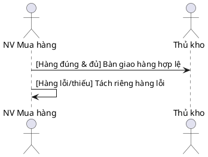
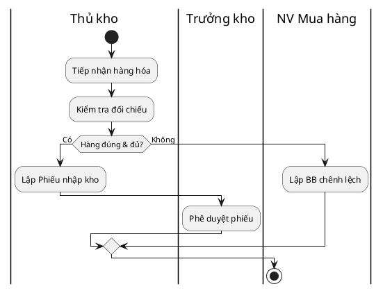
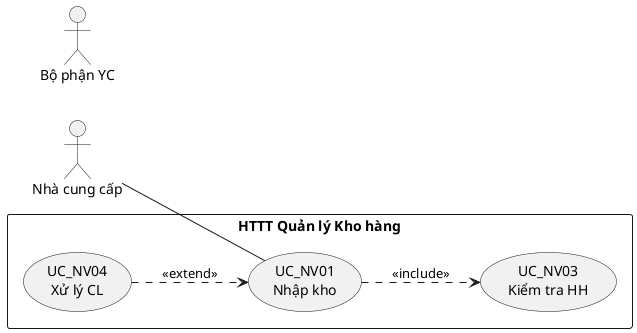
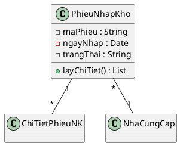

# Skill: PlantUML Best Practices cho PTTKHT

## Quy ước chung
- **Tất cả sơ đồ** trong project này sử dụng **PlantUML** (không dùng Mermaid).
- File PlantUML dùng cú pháp `@startuml` / `@enduml` bên trong block code markdown:
  ````markdown
  ```plantuml
  @startuml
  ...
  @enduml
  ```
  ````
- Preview trong VS Code bằng extension **PlantUML** (Cmd+Shift+V hoặc Alt+D).

---

## 1. Sequence Diagram – Cú pháp PlantUML (Tương thích IBM Rose)

### Khai báo Actor / Participant
```plantuml
actor "Thủ kho" as TK
actor "Trưởng kho" as TrK
participant "Hệ thống" as HT
```

### Message types
```plantuml
A -> B : Thông điệp đồng bộ (synchronous)
A --> B : Thông điệp trả về (return / dashed)
A ->> B : Thông điệp bất đồng bộ (async)
A -> A : Self-message (gửi cho chính mình)
```

### Guard Conditions (thay thế alt/opt – QUAN TRỌNG)
> **⚠️ IBM Rose KHÔNG hỗ trợ Interaction Fragments (alt, opt, loop, ref).**
> Dùng guard condition `[điều kiện]` trước tên message.



**Kỹ thuật rẽ nhánh bằng guard condition:**
- Từ cùng 1 lifeline, vẽ **nhiều mũi tên** với guard conditions khác nhau.
- Mỗi nhánh là 1 nhóm messages liên tiếp theo guard condition tương ứng.
- **KHÔNG dùng dividers** (`== ... ==`) – IBM Rose không có.
- **KHÔNG dùng group** để rẽ nhánh – nhóm chỉ để gom messages cho dễ đọc.
- Nếu sơ đồ quá phức tạp (nhiều nhánh chồng chéo), **tách thành nhiều sơ đồ riêng** (1 cho luồng chính, 1 cho luồng phụ).
- Dùng `note` để giải thích ngữ cảnh nếu cần.

> **⚠️ CÁC THÀNH PHẦN KHÔNG DÙNG (không có trong IBM Rose):**
> - `== ... ==` (dividers / separators)
> - `alt`, `opt`, `loop`, `ref` (interaction fragments)
> - `group` dùng để rẽ nhánh

### Notes (Ghi chú)
```plantuml
note right of TK : Ghi chú bên phải
note left of NVMH : Ghi chú bên trái
note over TK, NVMH : Ghi chú spanning nhiều lifeline

hnote over TK : Ghi chú dạng hexagon
rnote over TK : Ghi chú dạng rectangle
```

### Activation (Thanh kích hoạt)
```plantuml
activate TK
TK -> TK : Xử lý nội bộ
deactivate TK

' Hoặc tự động:
A -> B ++ : Message (auto activate B)
B --> A -- : Return (auto deactivate B)
```

### Grouping (Nhóm - dùng cho ghi chú, KHÔNG dùng để rẽ nhánh)
```plantuml
group Kiểm tra hàng hóa (<<include>> UC_NV03)
  TK -> TK : Đếm SL thực tế
  TK -> TK : Kiểm ngoại quan
end
```
> **Lưu ý:** `group` trong PlantUML chỉ để gom các message lại cho dễ đọc, KHÔNG phải để rẽ nhánh if/else.

---

## 2. Activity Diagram – Cú pháp PlantUML



**Ưu điểm so với Mermaid:**
- PlantUML Activity Diagram **hỗ trợ Swimlane** trực tiếp bằng cú pháp `|Tên Actor|`.
- Không cần bảng Swimlane Mapping riêng!

---

## 3. Use Case Diagram – Cú pháp PlantUML



---

## 4. Class Diagram – Cú pháp PlantUML



---

## 5. Các lỗi thường gặp & cách tránh

| Lỗi | Nguyên nhân | Cách fix |
|---|---|---|
| `Syntax Error` | Thiếu `@startuml` / `@enduml` | Luôn bọc code trong `@startuml...@enduml` |
| Ký tự đặc biệt trong tên | Dùng `&`, `<`, `>` trực tiếp | Bọc tên trong dấu `"..."` |
| Mũi tên sai hướng | Nhầm `->` vs `<-` | `A -> B` nghĩa là A gửi message cho B |
| Swimlane không hiện | Quên `|Tên|` trước action | Phải khai báo `|Tên|` ít nhất 1 lần trước action đầu tiên |
| `activate` lỗi | Activate participant chưa khai báo | Khai báo `actor` hoặc `participant` trước |
| Guard condition bị cắt | Tên quá dài | Dùng `\n` để xuống dòng hoặc rút gọn |

### Lưu ý quan trọng khi viết PlantUML:
1. **Tên có khoảng trắng** → Bọc trong `"dấu nháy kép"`.
2. **Xuống dòng trong text** → Dùng `\n`.
3. **Ký tự `&`** → Viết thẳng, PlantUML xử lý được.
4. **Thứ tự khai báo participant** = thứ tự hiển thị từ trái sang phải.
5. **Skinparam** để styling:
   ```plantuml
   skinparam sequenceArrowThickness 2
   skinparam actorStyle awesome
   skinparam backgroundColor #FEFEFE
   ```
