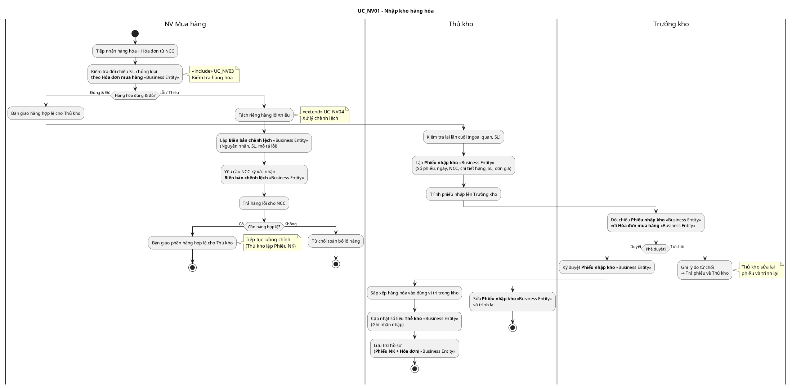

# Sơ đồ Hoạt động – UC_NV01: Nhập kho hàng hóa

## Mô tả
Sơ đồ hoạt động mô tả quy trình nhập kho hàng hóa với Swimlane (thừa tác viên) và Business Entity (thực thể dữ liệu).

```plantuml
@startuml
title UC_NV01 – Nhập kho hàng hóa

|NV Mua hàng|
start
:Tiếp nhận hàng hóa + Hóa đơn từ NCC;
:Kiểm tra đối chiếu SL, chủng loại
theo **Hóa đơn mua hàng** <<Business Entity>>;
note right: <<include>> UC_NV03\nKiểm tra hàng hóa

if (Hàng hóa đúng & đủ?) then (Đúng & Đủ)

  :Bàn giao hàng hợp lệ cho Thủ kho;

  |Thủ kho|
  :Kiểm tra lại lần cuối (ngoại quan, SL);
  :Lập **Phiếu nhập kho** <<Business Entity>>
  (Số phiếu, ngày, NCC, chi tiết hàng, SL, đơn giá);
  :Trình phiếu nhập lên Trưởng kho;

  |Trưởng kho|
  :Đối chiếu **Phiếu nhập kho** <<Business Entity>>
  với **Hóa đơn mua hàng** <<Business Entity>>;

  if (Phê duyệt?) then (Duyệt)
    :Ký duyệt **Phiếu nhập kho** <<Business Entity>>;

    |Thủ kho|
    :Sắp xếp hàng hóa vào đúng vị trí trong kho;
    :Cập nhật số liệu **Thẻ kho** <<Business Entity>>
    (Ghi nhận nhập);
    :Lưu trữ hồ sơ
    (**Phiếu NK** + **Hóa đơn**) <<Business Entity>>;
    stop

  else (Từ chối)
    |Trưởng kho|
    :Ghi lý do từ chối
    → Trả phiếu về Thủ kho;
    note right: Thủ kho sửa lại\nphiếu và trình lại
    |Thủ kho|
    :Sửa **Phiếu nhập kho** <<Business Entity>>
    và trình lại;
    stop
  endif

else (Lỗi / Thiếu)

  |NV Mua hàng|
  :Tách riêng hàng lỗi/thiếu;
  note right: <<extend>> UC_NV04\nXử lý chênh lệch
  :Lập **Biên bản chênh lệch** <<Business Entity>>
  (Nguyên nhân, SL, mô tả lỗi);
  :Yêu cầu NCC ký xác nhận
  **Biên bản chênh lệch** <<Business Entity>>;
  :Trả hàng lỗi cho NCC;

  if (Còn hàng hợp lệ?) then (Có)
    :Bàn giao phần hàng hợp lệ cho Thủ kho;
    note right: Tiếp tục luồng chính\n(Thủ kho lập Phiếu NK)
    stop
  else (Không)
    :Từ chối toàn bộ lô hàng;
    stop
  endif

endif

@enduml
```
