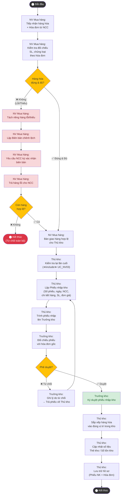

# Sơ đồ Hoạt động – UC_NV01: Nhập kho hàng hóa

## Mô tả
Sơ đồ hoạt động dưới đây mô tả toàn bộ quy trình nghiệp vụ nhập kho hàng hóa, từ lúc Nhà cung cấp giao hàng đến khi hàng được xếp vào kho và cập nhật tồn kho. Các swimlane thể hiện rõ trách nhiệm của từng tác nhân trong từng bước.

## Giải thích luồng

### Luồng chính (Main Flow)
Quá trình bắt đầu khi **Nhân viên mua hàng** tiếp nhận hàng hóa cùng hóa đơn từ Nhà cung cấp. Sau khi kiểm tra đối chiếu thành công (hàng đúng chủng loại, đủ số lượng), nhân viên bàn giao cho **Thủ kho**. Thủ kho kiểm tra lần cuối (<<include>> UC_NV03), lập Phiếu nhập kho và trình **Trưởng kho** phê duyệt. Sau khi được duyệt, hàng được xếp vào kho và số liệu tồn kho được cập nhật.

### Luồng ngoại lệ (<<extend>> UC_NV04 – Xử lý chênh lệch)
Nếu phát hiện hàng lỗi hoặc thiếu, NV mua hàng tách riêng hàng lỗi, lập Biên bản chênh lệch, yêu cầu NCC ký xác nhận và trả hàng lỗi. Nếu còn phần hàng hợp lệ, quy trình tiếp tục với phần hàng đó. Nếu toàn bộ lô hàng bị từ chối, quy trình kết thúc.
