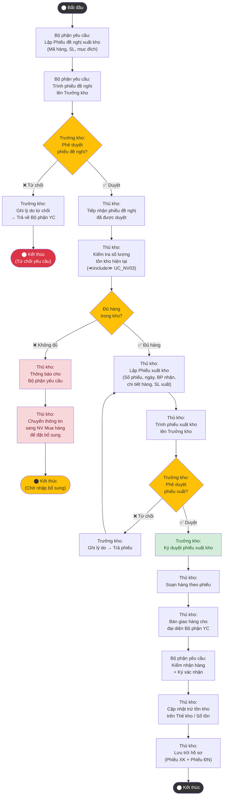

# Sơ đồ Hoạt động – UC_NV02: Xuất kho hàng hóa

## Mô tả
Sơ đồ hoạt động dưới đây mô tả quy trình nghiệp vụ xuất kho hàng hóa, từ khi Bộ phận yêu cầu lập phiếu đề nghị đến khi hàng được giao và tồn kho được trừ đi.

## 📐 Hướng dẫn vẽ lại trong IBM Rational Rose

### Swimlanes (Cột dọc)
| Swimlane | Tên Actor |
|---|---|
| Lane 1 | **Bộ phận yêu cầu (KD/SX)** |
| Lane 2 | **Trưởng kho** |
| Lane 3 | **Thủ kho** |
| Lane 4 | **NV Mua hàng** |

### Phân bổ Action States vào Swimlane

| Mã Node | Action State | Swimlane | Ký hiệu |
|---|---|---|---|
| Start | ⬤ Bắt đầu | Lane 1 | Initial Node (●) |
| B1 | Lập Phiếu đề nghị xuất kho | Lane 1 | Action State ▭ |
| B2 | Trình phiếu đề nghị lên Trưởng kho | Lane 1 → Lane 2 | ▭ (transition chéo) |
| D1 | [Phê duyệt phiếu đề nghị?] | Lane 2 | Decision ◇ |
| B3 | Ghi lý do từ chối → Trả về BP YC | Lane 2 | Action State ▭ |
| B4 | Tiếp nhận phiếu đề nghị đã duyệt | Lane 3 | Action State ▭ |
| B5 | Kiểm tra SL tồn kho (≪include≫ UC_NV03) | Lane 3 | Action State ▭ |
| D2 | [Đủ hàng trong kho?] | Lane 3 | Decision ◇ |
| C1 | Thông báo cho Bộ phận yêu cầu | Lane 3 | Action State ▭ |
| C2 | Chuyển thông tin sang NV Mua hàng | Lane 3 → Lane 4 | ▭ (transition chéo) |
| B6 | Lập Phiếu xuất kho | Lane 3 | Action State ▭ |
| B7 | Trình phiếu xuất kho lên Trưởng kho | Lane 3 → Lane 2 | ▭ (transition chéo) |
| D3 | [Phê duyệt phiếu xuất?] | Lane 2 | Decision ◇ |
| B8 | Ghi lý do → Trả phiếu | Lane 2 | Action State ▭ |
| B9 | Ký duyệt phiếu xuất kho | Lane 2 | Action State ▭ |
| B10 | Soạn hàng theo phiếu | Lane 3 | Action State ▭ |
| B11 | Bàn giao hàng cho đại diện BP YC | Lane 3 → Lane 1 | ▭ (transition chéo) |
| B12 | Kiểm nhận hàng + Ký xác nhận | Lane 1 | Action State ▭ |
| B13 | Cập nhật trừ tồn kho | Lane 3 | Action State ▭ |
| B14 | Lưu trữ hồ sơ (Phiếu XK + ĐN) | Lane 3 | Action State ▭ |
| End1 | ◉ Kết thúc (Từ chối) | Lane 2 | Final Node (◉) |
| End2 | ◉ Kết thúc (Chờ bổ sung) | Lane 4 | Final Node (◉) |
| End3 | ◉ Kết thúc | Lane 3 | Final Node (◉) |

### Guard Conditions
- D1 → B4: `[Duyệt]`
- D1 → B3: `[Từ chối]`
- D2 → B6: `[Đủ hàng]`
- D2 → C1: `[Không đủ hàng]`
- D3 → B9: `[Duyệt]`
- D3 → B8: `[Từ chối]`

---

## Giải thích luồng

### Luồng chính (Main Flow)
**Bộ phận yêu cầu** (KD/SX) lập Phiếu đề nghị xuất kho và trình **Trưởng kho** duyệt. Sau khi được duyệt, **Thủ kho** tiếp nhận phiếu, kiểm tra tồn kho (<<include>> UC_NV03). Nếu đủ hàng, Thủ kho lập Phiếu xuất kho, trình Trưởng kho ký duyệt, soạn hàng và bàn giao. Bộ phận yêu cầu ký nhận, Thủ kho cập nhật trừ tồn kho.

### Luồng thay thế
- **Không đủ hàng:** Thủ kho thông báo Bộ phận yêu cầu và chuyển thông tin sang NV mua hàng để đặt bổ sung từ NCC. Quy trình tạm dừng, chờ nhập bổ sung.
- **Trưởng kho từ chối phiếu đề nghị:** Ghi lý do, trả về Bộ phận yêu cầu, quy trình kết thúc.
