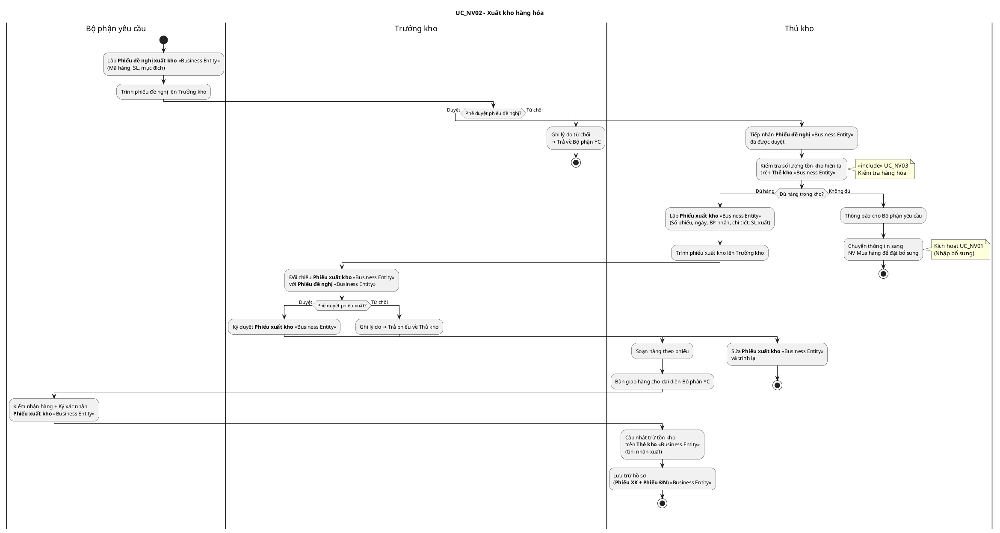

# Sơ đồ Hoạt động – UC_NV02: Xuất kho hàng hóa

```plantuml
@startuml
title UC_NV02 – Xuất kho hàng hóa

|Bộ phận yêu cầu|
start
:Lập **Phiếu đề nghị xuất kho** <<Business Entity>>
(Mã hàng, SL, mục đích);
:Trình phiếu đề nghị lên Trưởng kho;

|Trưởng kho|
if (Phê duyệt phiếu đề nghị?) then (Duyệt)

  |Thủ kho|
  :Tiếp nhận **Phiếu đề nghị** <<Business Entity>>
  đã được duyệt;
  :Kiểm tra số lượng tồn kho hiện tại
  trên **Thẻ kho** <<Business Entity>>;
  note right: <<include>> UC_NV03\nKiểm tra hàng hóa

  if (Đủ hàng trong kho?) then (Đủ hàng)
    :Lập **Phiếu xuất kho** <<Business Entity>>
    (Số phiếu, ngày, BP nhận, chi tiết, SL xuất);
    :Trình phiếu xuất kho lên Trưởng kho;

    |Trưởng kho|
    :Đối chiếu **Phiếu xuất kho** <<Business Entity>>
    với **Phiếu đề nghị** <<Business Entity>>;

    if (Phê duyệt phiếu xuất?) then (Duyệt)
      :Ký duyệt **Phiếu xuất kho** <<Business Entity>>;

      |Thủ kho|
      :Soạn hàng theo phiếu;
      :Bàn giao hàng cho đại diện Bộ phận YC;

      |Bộ phận yêu cầu|
      :Kiểm nhận hàng + Ký xác nhận
      **Phiếu xuất kho** <<Business Entity>>;

      |Thủ kho|
      :Cập nhật trừ tồn kho
      trên **Thẻ kho** <<Business Entity>>
      (Ghi nhận xuất);
      :Lưu trữ hồ sơ
      (**Phiếu XK** + **Phiếu ĐN**) <<Business Entity>>;
      stop

    else (Từ chối)
      |Trưởng kho|
      :Ghi lý do → Trả phiếu về Thủ kho;
      |Thủ kho|
      :Sửa **Phiếu xuất kho** <<Business Entity>>
      và trình lại;
      stop
    endif

  else (Không đủ)
    |Thủ kho|
    :Thông báo cho Bộ phận yêu cầu;
    :Chuyển thông tin sang
    NV Mua hàng để đặt bổ sung;
    note right: Kích hoạt UC_NV01\n(Nhập bổ sung)
    stop
  endif

else (Từ chối)
  |Trưởng kho|
  :Ghi lý do từ chối
  → Trả về Bộ phận YC;
  stop
endif

@enduml
```
