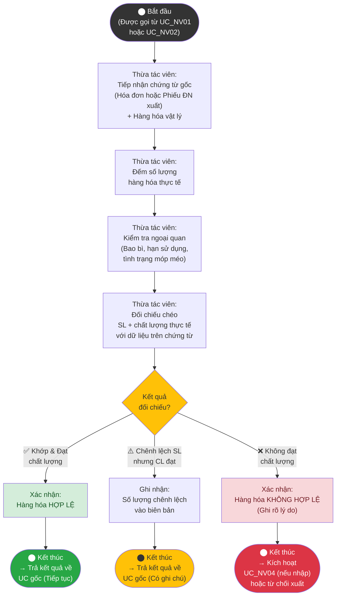

# Sơ đồ Hoạt động – UC_NV03: Kiểm tra hàng hóa

## Mô tả
Đây là Use Case dùng chung (<<include>>) được gọi từ UC_NV01 (Nhập kho) và UC_NV02 (Xuất kho). Thừa tác viên (Nhân viên mua hàng hoặc Thủ kho, tùy ngữ cảnh) tiến hành kiểm tra một lô hàng cụ thể theo chứng từ đi kèm.

## 📐 Hướng dẫn vẽ lại trong IBM Rational Rose

### Swimlanes
| Swimlane | Tên Actor |
|---|---|
| Lane 1 | **Thừa tác viên (NV Mua hàng hoặc Thủ kho)** |

> **Lưu ý:** UC này chỉ có 1 swimlane vì chỉ có 1 tác nhân thực hiện (tùy ngữ cảnh). Trong Rose, có thể đặt trong 1 lane duy nhất hoặc không dùng swimlane.

### Phân bổ Action States

| Mã Node | Action State | Ký hiệu |
|---|---|---|
| Start | ⬤ Bắt đầu (được gọi từ UC_NV01 hoặc UC_NV02) | Initial Node (●) |
| C1 | Tiếp nhận chứng từ gốc + Hàng hóa vật lý | Action State ▭ |
| C2 | Đếm số lượng hàng hóa thực tế | Action State ▭ |
| C3 | Kiểm tra ngoại quan (bao bì, HSD, móp méo) | Action State ▭ |
| C4 | Đối chiếu chéo SL + CL thực tế vs chứng từ | Action State ▭ |
| D1 | [Kết quả đối chiếu?] | Decision ◇ |
| R1 | Xác nhận: Hàng hóa HỢP LỆ | Action State ▭ |
| R2 | Ghi nhận: Số lượng chênh lệch | Action State ▭ |
| R3 | Xác nhận: KHÔNG HỢP LỆ (ghi rõ lý do) | Action State ▭ |
| End1 | ◉ Trả kết quả về UC gốc (Tiếp tục) | Final Node (◉) |
| End2 | ◉ Trả kết quả + Ghi chú | Final Node (◉) |
| End3 | ◉ Kích hoạt UC_NV04 / Từ chối xuất | Final Node (◉) |

### Guard Conditions
- D1 → R1: `[Khớp & Đạt chất lượng]`
- D1 → R2: `[Chênh lệch SL, CL đạt]`
- D1 → R3: `[Không đạt chất lượng]`

---

## Giải thích luồng
- **Hợp lệ:** Số lượng khớp, chất lượng đạt → Xác nhận hợp lệ, trả kết quả dương về UC gốc để tiếp tục.
- **Chênh lệch số lượng:** Ghi chú vào biên bản, vẫn có thể tiếp tục nhưng cần lưu ý khi lập phiếu.
- **Không hợp lệ:** Chất lượng không đạt → Kích hoạt UC_NV04 (Xử lý chênh lệch) nếu đang ở luồng nhập kho, hoặc từ chối xuất nếu đang ở luồng xuất kho.
