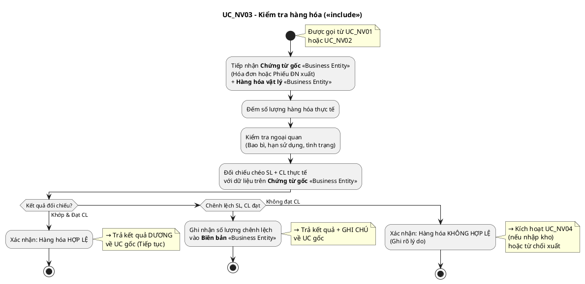

# Sơ đồ Hoạt động – UC_NV03: Kiểm tra hàng hóa

```plantuml
@startuml
title UC_NV03 – Kiểm tra hàng hóa (<<include>>)

|Thừa tác viên (NV MH / Thủ kho)|
start
note right: Được gọi từ UC_NV01\nhoặc UC_NV02

:Tiếp nhận **Chứng từ gốc** <<Business Entity>>
(Hóa đơn hoặc Phiếu ĐN xuất)
+ **Hàng hóa vật lý** <<Business Entity>>;
:Đếm số lượng hàng hóa thực tế;
:Kiểm tra ngoại quan
(Bao bì, hạn sử dụng, tình trạng);
:Đối chiếu chéo SL + CL thực tế
với dữ liệu trên **Chứng từ gốc** <<Business Entity>>;

if (Kết quả đối chiếu?) then (Khớp & Đạt CL)
  :Xác nhận: Hàng hóa HỢP LỆ;
  note right: → Trả kết quả DƯƠNG\nvề UC gốc (Tiếp tục)
  stop

elseif (Chênh lệch SL, CL đạt) then
  :Ghi nhận số lượng chênh lệch
  vào **Biên bản** <<Business Entity>>;
  note right: → Trả kết quả + GHI CHÚ\nvề UC gốc
  stop

else (Không đạt CL)
  :Xác nhận: Hàng hóa KHÔNG HỢP LỆ
  (Ghi rõ lý do);
  note right: → Kích hoạt UC_NV04\n(nếu nhập kho)\nhoặc từ chối xuất
  stop

endif

@enduml
```
