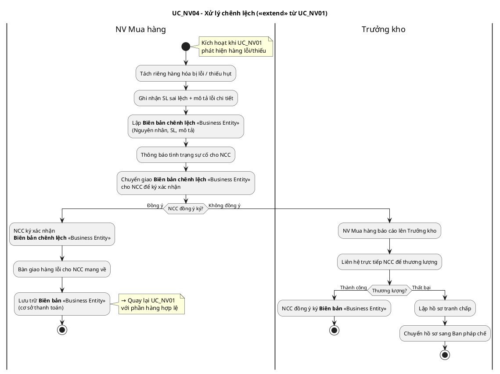

# Sơ đồ Hoạt động – UC_NV04: Xử lý chênh lệch

```plantuml
@startuml
title UC_NV04 – Xử lý chênh lệch (<<extend>> từ UC_NV01)

|NV Mua hàng|
start
note right: Kích hoạt khi UC_NV01\nphát hiện hàng lỗi/thiếu

:Tách riêng hàng hóa bị lỗi / thiếu hụt;
:Ghi nhận SL sai lệch + mô tả lỗi chi tiết;
:Lập **Biên bản chênh lệch** <<Business Entity>>
(Nguyên nhân, SL, mô tả);
:Thông báo tình trạng sự cố cho NCC;
:Chuyển giao **Biên bản chênh lệch** <<Business Entity>>
cho NCC để ký xác nhận;

if (NCC đồng ý ký?) then (Đồng ý)
  :NCC ký xác nhận
  **Biên bản chênh lệch** <<Business Entity>>;
  :Bàn giao hàng lỗi cho NCC mang về;
  :Lưu trữ **Biên bản** <<Business Entity>>
  (cơ sở thanh toán);
  note right: → Quay lại UC_NV01\nvới phần hàng hợp lệ
  stop

else (Không đồng ý)

  |Trưởng kho|
  :NV Mua hàng báo cáo lên Trưởng kho;
  :Liên hệ trực tiếp NCC để thương lượng;

  if (Thương lượng?) then (Thành công)
    :NCC đồng ý ký **Biên bản** <<Business Entity>>;
    stop
  else (Thất bại)
    :Lập hồ sơ tranh chấp;
    :Chuyển hồ sơ sang Ban pháp chế;
    stop
  endif

endif

@enduml
```
