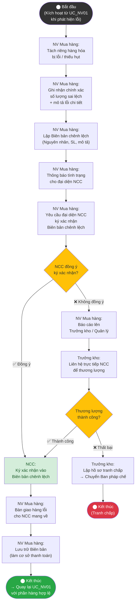

# Sơ đồ Hoạt động – UC_NV04: Xử lý chênh lệch

## Mô tả
Quy trình xử lý ngoại lệ (<<extend>>) chỉ được kích hoạt khi UC_NV01 (Nhập kho) phát hiện hàng hóa bị lỗi, thiếu hụt hoặc sai quy cách.

## 📐 Hướng dẫn vẽ lại trong IBM Rational Rose

### Swimlanes
| Swimlane | Tên Actor |
|---|---|
| Lane 1 | **NV Mua hàng** |
| Lane 2 | **Nhà cung cấp (NCC)** |
| Lane 3 | **Trưởng kho** |

### Phân bổ Action States

| Mã Node | Action State | Swimlane | Ký hiệu |
|---|---|---|---|
| Start | ⬤ Bắt đầu (từ UC_NV01) | Lane 1 | Initial Node (●) |
| D1 | Tách riêng hàng lỗi / thiếu hụt | Lane 1 | Action State ▭ |
| D2 | Ghi nhận SL sai lệch + mô tả lỗi | Lane 1 | Action State ▭ |
| D3 | Lập Biên bản chênh lệch | Lane 1 | Action State ▭ |
| D4 | Thông báo tình trạng cho NCC | Lane 1 → Lane 2 | ▭ (transition chéo) |
| D5 | Yêu cầu NCC ký xác nhận BB | Lane 1 → Lane 2 | ▭ (transition chéo) |
| D6 | [NCC đồng ý ký?] | Lane 2 | Decision ◇ |
| D7 | Ký xác nhận Biên bản | Lane 2 | Action State ▭ |
| D8 | Bàn giao hàng lỗi cho NCC | Lane 1 → Lane 2 | ▭ (transition chéo) |
| D9 | Lưu trữ Biên bản | Lane 1 | Action State ▭ |
| D10 | Báo cáo lên Trưởng kho | Lane 1 → Lane 3 | ▭ (transition chéo) |
| D11 | Liên hệ trực tiếp NCC thương lượng | Lane 3 → Lane 2 | ▭ (transition chéo) |
| D12 | [Thương lượng thành công?] | Lane 3 | Decision ◇ |
| D13 | Lập hồ sơ tranh chấp | Lane 3 | Action State ▭ |
| End1 | ◉ Quay lại UC_NV01 | Lane 1 | Final Node (◉) |
| End2 | ◉ Kết thúc (Tranh chấp) | Lane 3 | Final Node (◉) |

### Guard Conditions
- D6 → D7: `[Đồng ý]`
- D6 → D10: `[Không đồng ý]`
- D12 → D7: `[Thành công]`
- D12 → D13: `[Thất bại]`

---

## Giải thích luồng
### Luồng chính
NV mua hàng tách hàng lỗi, lập Biên bản chênh lệch, yêu cầu NCC ký xác nhận → Trả hàng lỗi → Lưu biên bản → Quay lại UC_NV01.

### Luồng thay thế
NCC không đồng ý ký → Báo cáo Trưởng kho → Thương lượng trực tiếp. Nếu thành công → ký biên bản. Nếu thất bại → lập hồ sơ tranh chấp.
