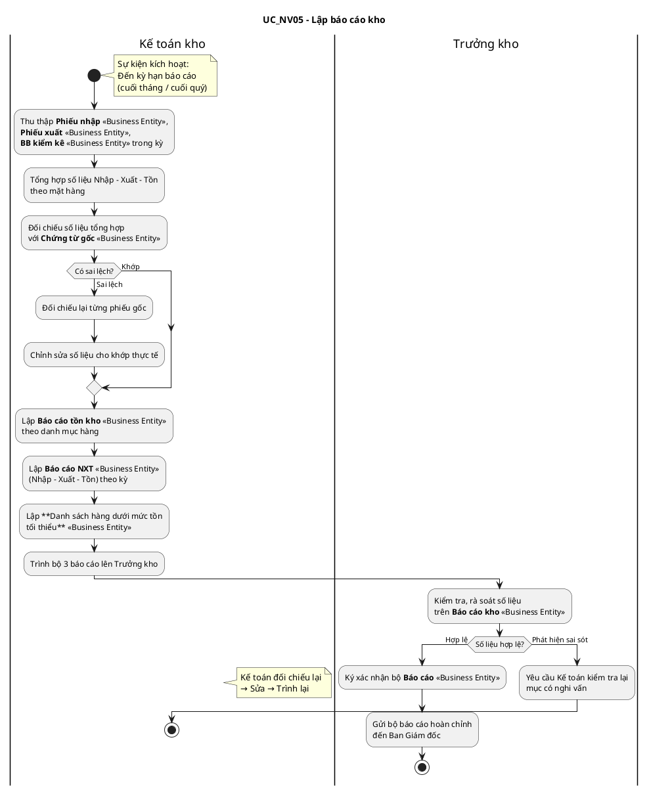

# Sơ đồ Hoạt động – UC_NV05: Lập báo cáo kho

```plantuml
@startuml
title UC_NV05 – Lập báo cáo kho

|Kế toán kho|
start
note right: Sự kiện kích hoạt:\nĐến kỳ hạn báo cáo\n(cuối tháng / cuối quý)

:Thu thập **Phiếu nhập** <<Business Entity>>,
**Phiếu xuất** <<Business Entity>>,
**BB kiểm kê** <<Business Entity>> trong kỳ;
:Tổng hợp số liệu Nhập – Xuất – Tồn
theo mặt hàng;
:Đối chiếu số liệu tổng hợp
với **Chứng từ gốc** <<Business Entity>>;

if (Có sai lệch?) then (Sai lệch)
  :Đối chiếu lại từng phiếu gốc;
  :Chỉnh sửa số liệu cho khớp thực tế;
else (Khớp)
endif

:Lập **Báo cáo tồn kho** <<Business Entity>>
theo danh mục hàng;
:Lập **Báo cáo NXT** <<Business Entity>>
(Nhập – Xuất – Tồn) theo kỳ;
:Lập **Danh sách hàng dưới mức tồn
tối thiểu** <<Business Entity>>;
:Trình bộ 3 báo cáo lên Trưởng kho;

|Trưởng kho|
:Kiểm tra, rà soát số liệu
trên **Báo cáo kho** <<Business Entity>>;

if (Số liệu hợp lệ?) then (Hợp lệ)
  :Ký xác nhận bộ **Báo cáo** <<Business Entity>>;
  :Gửi bộ báo cáo hoàn chỉnh
  đến Ban Giám đốc;
  stop

else (Phát hiện sai sót)
  :Yêu cầu Kế toán kiểm tra lại
  mục có nghi vấn;
  |Kế toán kho|
  note right: Kế toán đối chiếu lại\n→ Sửa → Trình lại
  stop
endif

@enduml
```
