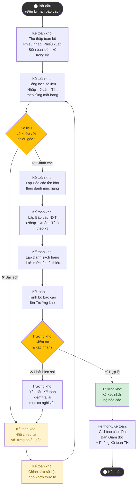

# Sơ đồ Hoạt động – UC_NV05: Lập báo cáo kho

## Mô tả
Quy trình tổng hợp số liệu nhập – xuất – tồn kho để lập báo cáo định kỳ (cuối tháng/cuối quý) trình Ban Giám đốc.

## Giải thích luồng
### Luồng chính
Kế toán kho thu thập chứng từ → Tổng hợp NXT → Lập 3 loại báo cáo (tồn kho, NXT, hàng dưới mức tối thiểu) → Trình Trưởng kho duyệt → Gửi Ban GĐ.

### Luồng thay thế
- Phát hiện sai lệch trong quá trình tổng hợp → Đối chiếu lại phiếu gốc → Chỉnh sửa → Tiếp tục.
- Trưởng kho phát hiện sai → Yêu cầu kiểm tra lại → Vòng lặp cho đến khi chính xác.
