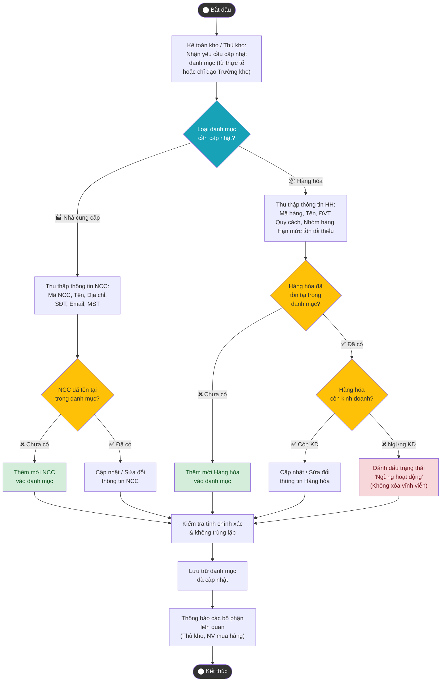

# Sơ đồ Hoạt động – UC_NV06: Quản lý danh mục cơ sở

## Mô tả
Quy trình thiết lập, duy trì và cập nhật các thông tin nền tảng (danh mục Nhà cung cấp và danh mục Hàng hóa) phục vụ cho toàn bộ hoạt động nghiệp vụ kho hàng.

## Giải thích luồng
### Luồng chính
Tác nhân nhận yêu cầu → Xác định loại danh mục (NCC hoặc Hàng hóa) → Thu thập thông tin → Kiểm tra tồn tại → Thêm mới hoặc Cập nhật → Kiểm tra chính xác → Lưu trữ → Thông báo.

### Luồng thay thế
- Hàng hóa ngừng kinh doanh → Đánh dấu "Ngừng hoạt động" thay vì xóa (bảo toàn lịch sử giao dịch).
- NCC ngừng hợp tác → Tương tự, đánh dấu trạng thái thay vì xóa.
