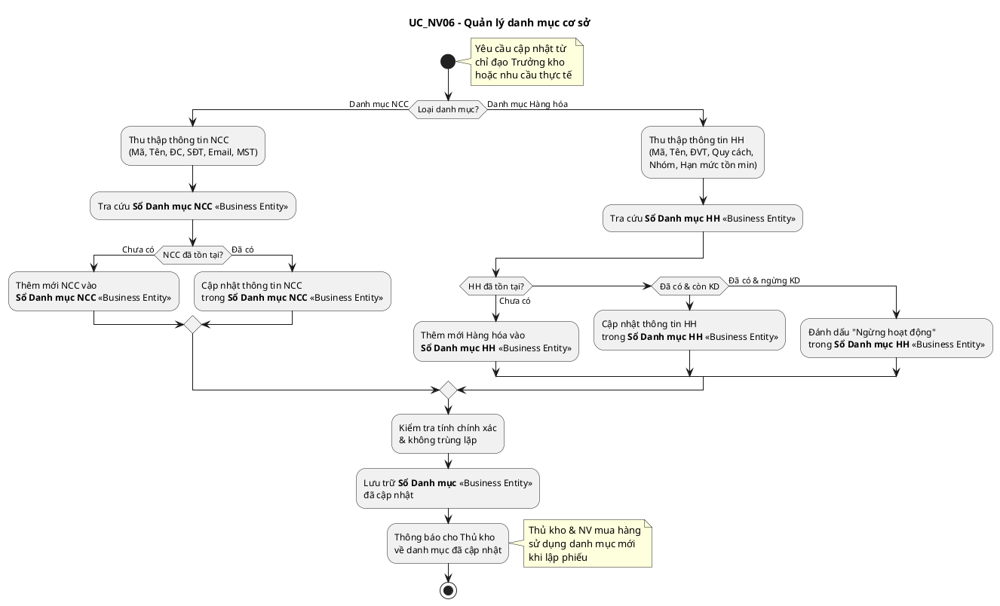

# Sơ đồ Hoạt động – UC_NV06: Quản lý danh mục cơ sở

```plantuml
@startuml
title UC_NV06 – Quản lý danh mục cơ sở

|Kế toán kho|
start
note right: Yêu cầu cập nhật từ\nchỉ đạo Trưởng kho\nhoặc nhu cầu thực tế

if (Loại danh mục?) then (Danh mục NCC)

  :Thu thập thông tin NCC
  (Mã, Tên, ĐC, SĐT, Email, MST);
  :Tra cứu **Sổ Danh mục NCC** <<Business Entity>>;

  if (NCC đã tồn tại?) then (Chưa có)
    :Thêm mới NCC vào
    **Sổ Danh mục NCC** <<Business Entity>>;
  else (Đã có)
    :Cập nhật thông tin NCC
    trong **Sổ Danh mục NCC** <<Business Entity>>;
  endif

else (Danh mục Hàng hóa)

  :Thu thập thông tin HH
  (Mã, Tên, ĐVT, Quy cách,
  Nhóm, Hạn mức tồn min);
  :Tra cứu **Sổ Danh mục HH** <<Business Entity>>;

  if (HH đã tồn tại?) then (Chưa có)
    :Thêm mới Hàng hóa vào
    **Sổ Danh mục HH** <<Business Entity>>;
  elseif (Đã có & còn KD) then
    :Cập nhật thông tin HH
    trong **Sổ Danh mục HH** <<Business Entity>>;
  else (Đã có & ngừng KD)
    :Đánh dấu "Ngừng hoạt động"
    trong **Sổ Danh mục HH** <<Business Entity>>;
  endif

endif

:Kiểm tra tính chính xác
& không trùng lặp;
:Lưu trữ **Sổ Danh mục** <<Business Entity>>
đã cập nhật;
:Thông báo cho Thủ kho
về danh mục đã cập nhật;
note right: Thủ kho & NV mua hàng\nsử dụng danh mục mới\nkhi lập phiếu
stop

@enduml
```
