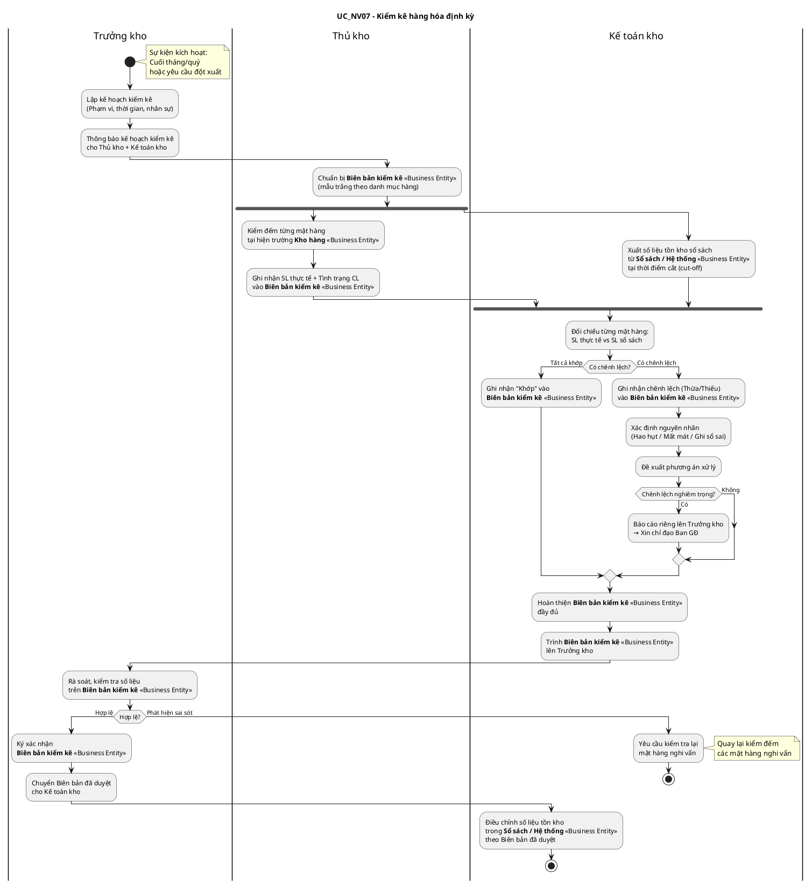

# Sơ đồ Hoạt động – UC_NV07: Kiểm kê hàng hóa định kỳ

```plantuml
@startuml
title UC_NV07 – Kiểm kê hàng hóa định kỳ

|Trưởng kho|
start
note right: Sự kiện kích hoạt:\nCuối tháng/quý\nhoặc yêu cầu đột xuất

:Lập kế hoạch kiểm kê
(Phạm vi, thời gian, nhân sự);
:Thông báo kế hoạch kiểm kê
cho Thủ kho + Kế toán kho;

|Thủ kho|
:Chuẩn bị **Biên bản kiểm kê** <<Business Entity>>
(mẫu trắng theo danh mục hàng);

fork
  :Kiểm đếm từng mặt hàng
  tại hiện trường **Kho hàng** <<Business Entity>>;
  :Ghi nhận SL thực tế + Tình trạng CL
  vào **Biên bản kiểm kê** <<Business Entity>>;
fork again
  |Kế toán kho|
  :Xuất số liệu tồn kho sổ sách
  từ **Sổ sách / Hệ thống** <<Business Entity>>
  tại thời điểm cắt (cut-off);
end fork

|Kế toán kho|
:Đối chiếu từng mặt hàng:
SL thực tế vs SL sổ sách;

if (Có chênh lệch?) then (Tất cả khớp)
  :Ghi nhận "Khớp" vào
  **Biên bản kiểm kê** <<Business Entity>>;
else (Có chênh lệch)
  :Ghi nhận chênh lệch (Thừa/Thiếu)
  vào **Biên bản kiểm kê** <<Business Entity>>;
  :Xác định nguyên nhân
  (Hao hụt / Mất mát / Ghi sổ sai);
  :Đề xuất phương án xử lý;

  if (Chênh lệch nghiêm trọng?) then (Có)
    :Báo cáo riêng lên Trưởng kho
    → Xin chỉ đạo Ban GĐ;
  else (Không)
  endif

endif

:Hoàn thiện **Biên bản kiểm kê** <<Business Entity>>
đầy đủ;
:Trình **Biên bản kiểm kê** <<Business Entity>>
lên Trưởng kho;

|Trưởng kho|
:Rà soát, kiểm tra số liệu
trên **Biên bản kiểm kê** <<Business Entity>>;

if (Hợp lệ?) then (Hợp lệ)
  :Ký xác nhận
  **Biên bản kiểm kê** <<Business Entity>>;
  :Chuyển Biên bản đã duyệt
  cho Kế toán kho;

  |Kế toán kho|
  :Điều chỉnh số liệu tồn kho
  trong **Sổ sách / Hệ thống** <<Business Entity>>
  theo Biên bản đã duyệt;
  stop

else (Phát hiện sai sót)
  :Yêu cầu kiểm tra lại
  mặt hàng nghi vấn;
  note right: Quay lại kiểm đếm\ncác mặt hàng nghi vấn
  stop
endif

@enduml
```
