# Sơ đồ Hoạt động – UC_NV07: Kiểm kê hàng hóa định kỳ

## Mô tả
Quy trình kiểm đếm thực tế toàn bộ hàng hóa trong kho theo định kỳ (cuối tháng/quý) hoặc đột xuất, đối chiếu với sổ sách để phát hiện và xử lý chênh lệch.

```mermaid
flowchart TD
    Start(["⬤ Bắt đầu<br/>(Đến kỳ kiểm kê<br/>hoặc yêu cầu đột xuất)"])

    Start --> G1["Trưởng kho:<br/>Lập kế hoạch kiểm kê<br/>(Phạm vi, thời gian,<br/>phân công nhân sự)"]
    G1 --> G2["Trưởng kho:<br/>Thông báo kế hoạch<br/>đến Thủ kho + Kế toán kho"]
    G2 --> G3["Thủ kho:<br/>Chuẩn bị biểu mẫu<br/>Biên bản kiểm kê trắng<br/>theo danh mục hàng"]
    G3 --> G4["Đội kiểm kê<br/>(Thủ kho + Kế toán):<br/>Kiểm đếm thực tế<br/>từng mặt hàng tại kho"]
    G4 --> G5["Đội kiểm kê:<br/>Kiểm tra tình trạng<br/>chất lượng hàng hóa<br/>(Hư hỏng, hết hạn, mất)"]
    G5 --> G6["Đội kiểm kê:<br/>Ghi nhận kết quả<br/>vào Biên bản kiểm kê<br/>hiện trường"]
    G6 --> G7["Kế toán kho:<br/>Xuất số liệu tồn kho<br/>trên sổ sách/hệ thống<br/>tại thời điểm cắt"]
    G7 --> G8["Đội kiểm kê:<br/>Đối chiếu SL thực tế<br/>vs SL sổ sách<br/>cho từng mặt hàng"]
    G8 --> D1{"Có chênh lệch?"}

    D1 -->|"✅ Không<br/>(Tất cả khớp)"| G9["Ghi nhận 'Khớp'<br/>vào Biên bản"]
    
    D1 -->|"⚠️ Có chênh lệch"| G10["Ghi nhận mức<br/>chênh lệch<br/>(Thừa/Thiếu bao nhiêu)"]
    G10 --> G11["Xác định nguyên nhân:<br/>• Hao hụt tự nhiên<br/>• Mất mát/thất thoát<br/>• Ghi sổ sai<br/>• Khác"]
    G11 --> G12["Đề xuất phương án:<br/>• Điều chỉnh sổ<br/>• Quy trách nhiệm<br/>• Bổ sung hàng"]
    G12 --> D2{"Chênh lệch<br/>nghiêm trọng?<br/>(Vượt ngưỡng)"}
    D2 -->|"❌ Không"| G9
    D2 -->|"⚠️ Nghiêm trọng"| G13["Trưởng kho:<br/>Lập báo cáo riêng<br/>trình Ban Giám đốc<br/>xin chỉ đạo xử lý"]
    G13 --> G9

    G9 --> G14["Đội kiểm kê:<br/>Hoàn thiện Biên bản<br/>kiểm kê đầy đủ"]
    G14 --> G15["Trình Biên bản<br/>lên Trưởng kho"]
    G15 --> D3{"Trưởng kho:<br/>Rà soát &<br/>phê duyệt?"}

    D3 -->|"❌ Phát hiện sai"| G16["Trưởng kho:<br/>Yêu cầu kiểm tra lại<br/>các mặt hàng nghi vấn"]
    G16 --> G4

    D3 -->|"✅ Hợp lệ"| G17["Trưởng kho:<br/>Ký xác nhận<br/>Biên bản kiểm kê"]
    G17 --> G18["Kế toán kho:<br/>Điều chỉnh số liệu<br/>tồn kho trên sổ sách<br/>theo biên bản đã duyệt"]
    G18 --> End(["⬤ Kết thúc"])

    %% Styling
    style Start fill:#333,color:#fff
    style End fill:#333,color:#fff
    style D1 fill:#ffc107,color:#333
    style D2 fill:#ffc107,color:#333
    style D3 fill:#ffc107,color:#333
    style G10 fill:#fff3cd,color:#856404
    style G13 fill:#f8d7da,color:#721c24
    style G17 fill:#d4edda,color:#155724
```

## 📐 Hướng dẫn vẽ lại trong IBM Rational Rose

### Swimlanes
| Swimlane | Tên Actor |
|---|---|
| Lane 1 | **Trưởng kho** |
| Lane 2 | **Thủ kho** |
| Lane 3 | **Kế toán kho** |

### Phân bổ Action States

| Mã Node | Action State | Swimlane | Ký hiệu |
|---|---|---|---|
| Start | ⬤ Bắt đầu (kỳ kiểm kê / đột xuất) | Lane 1 | Initial Node (●) |
| G1 | Lập kế hoạch kiểm kê | Lane 1 | Action State ▭ |
| G2 | Thông báo kế hoạch đến TK + KTK | Lane 1 → Lane 2, 3 | ▭ (transition chéo) |
| G3 | Chuẩn bị biên bản kiểm kê trắng | Lane 2 | Action State ▭ |
| G4 | Kiểm đếm thực tế từng mặt hàng | Lane 2 + Lane 3 | Action State ▭ (Fork bar) |
| G5 | Kiểm tra tình trạng chất lượng | Lane 2 + Lane 3 | Action State ▭ |
| G6 | Ghi nhận kết quả vào BB kiểm kê | Lane 2 | Action State ▭ |
| G7 | Xuất SL tồn kho sổ sách (cut-off) | Lane 3 | Action State ▭ |
| G8 | Đối chiếu SL thực tế vs sổ sách | Lane 3 | Action State ▭ |
| D1 | [Có chênh lệch?] | Lane 3 | Decision ◇ |
| G9 | Ghi nhận "Khớp" vào BB | Lane 3 | Action State ▭ |
| G10 | Ghi nhận chênh lệch (Thừa/Thiếu) | Lane 3 | Action State ▭ |
| G11 | Xác định nguyên nhân | Lane 3 | Action State ▭ |
| G12 | Đề xuất phương án xử lý | Lane 3 | Action State ▭ |
| D2 | [Chênh lệch nghiêm trọng?] | Lane 3 | Decision ◇ |
| G13 | Lập báo cáo riêng trình Ban GĐ | Lane 1 | Action State ▭ |
| G14 | Hoàn thiện Biên bản kiểm kê | Lane 2 + Lane 3 | Action State ▭ (Join bar) |
| G15 | Trình BB lên Trưởng kho | Lane 2 → Lane 1 | ▭ (transition chéo) |
| D3 | [Trưởng kho phê duyệt?] | Lane 1 | Decision ◇ |
| G16 | Yêu cầu kiểm tra lại mặt hàng nghi vấn | Lane 1 | Action State ▭ |
| G17 | Ký xác nhận BB kiểm kê | Lane 1 | Action State ▭ |
| G18 | Điều chỉnh tồn kho theo BB đã duyệt | Lane 3 | Action State ▭ |
| End | ◉ Kết thúc | Lane 3 | Final Node (◉) |

### Guard Conditions
- D1 → G9: `[Tất cả khớp]`
- D1 → G10: `[Có chênh lệch]`
- D2 → G9: `[Không nghiêm trọng]`
- D2 → G13: `[Nghiêm trọng (vượt ngưỡng)]`
- D3 → G17: `[Hợp lệ]`
- D3 → G16: `[Phát hiện sai sót]`

### Lưu ý đặc biệt cho Rose
- Bước G4-G5: Sử dụng **Fork Bar** (thanh ngang) để thể hiện Thủ kho và Kế toán kho kiểm đếm đồng thời.
- Bước G14: Sử dụng **Join Bar** để hợp nhất kết quả trước khi hoàn thiện biên bản.

---

## Giải thích luồng

### Luồng chính
**Trưởng kho** lập kế hoạch, phân công → **Đội kiểm kê** (Thủ kho + Kế toán) kiểm đếm từng mặt hàng, kiểm tra chất lượng → Ghi biên bản → **Kế toán kho** xuất số liệu sổ sách → Đối chiếu → Hoàn thiện biên bản → **Trưởng kho** duyệt → **Kế toán** điều chỉnh tồn kho.

### Luồng thay thế
- **Có chênh lệch:** Ghi nhận mức chênh lệch, xác định nguyên nhân, đề xuất xử lý.
- **Chênh lệch nghiêm trọng:** Trưởng kho lập báo cáo riêng trình Ban GĐ trước khi điều chỉnh.
- **Trưởng kho phát hiện sai sót biên bản:** Yêu cầu kiểm tra lại (vòng lặp).
