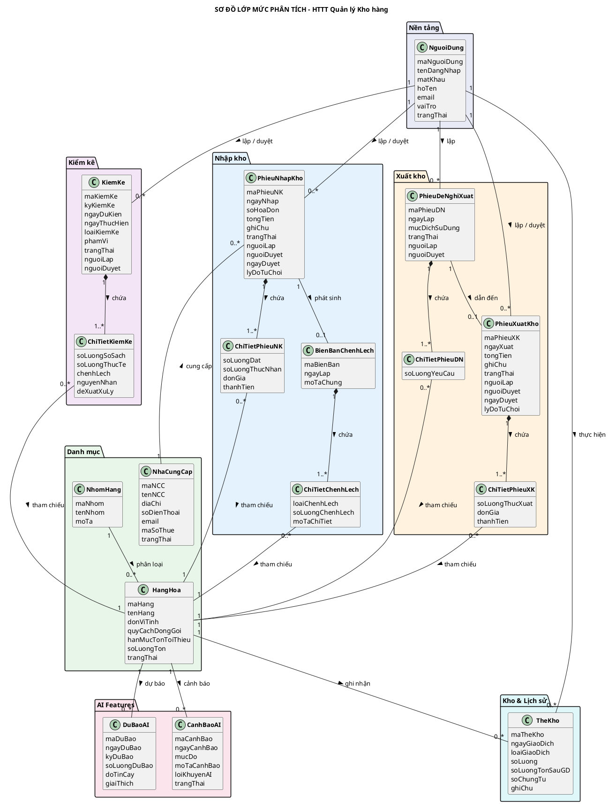

# Sơ đồ Lớp mức Phân tích – HTTT Quản lý Kho hàng

## Mô tả tổng quan
Sơ đồ lớp mức phân tích thể hiện các **lớp thực thể (Entity Classes)** được nhận diện từ các Use Case hệ thống (UC_HT01 → UC_HT17). Ở mức phân tích, tập trung vào:
- **Thuộc tính** chính của mỗi lớp (chưa chi tiết kiểu dữ liệu đầy đủ).
- **Quan hệ** giữa các lớp: Association, Composition, Aggregation.
- **Multiplicity** (bội số): 1, 0..1, 1..*, 0..*.

> Mức thiết kế (Design Class Diagram) sẽ bổ sung thêm Boundary Classes, Control Classes, Access Modifiers, Methods chi tiết.

---

## Ma trận truy vết: UC Hệ thống → Lớp phân tích

| Lớp thực thể | Suy ra từ UC |
|---|---|
| NguoiDung | UC_HT01 (Đăng nhập / Phân quyền) |
| NhaCungCap | UC_HT02 (QL Danh mục NCC) |
| HangHoa | UC_HT03 (QL Danh mục HH) |
| NhomHang | UC_HT03 (Nhóm hàng dùng trong QL HH) |
| PhieuNhapKho | UC_HT04 (Lập phiếu NK), UC_HT05 (Phê duyệt NK) |
| ChiTietPhieuNK | UC_HT04 (Chi tiết dòng hàng trong phiếu NK) |
| PhieuDeNghiXuat | UC_HT06 (Lập Phiếu đề nghị XK) |
| ChiTietPhieuDN | UC_HT06 (Chi tiết dòng hàng trong đề nghị) |
| PhieuXuatKho | UC_HT07 (Lập Phiếu XK), UC_HT08 (Phê duyệt XK) |
| ChiTietPhieuXK | UC_HT07 (Chi tiết dòng hàng trong phiếu XK) |
| BienBanChenhLech | UC_HT10 (Lập BB chênh lệch) |
| ChiTietChenhLech | UC_HT10 (Chi tiết mặt hàng chênh lệch) |
| KiemKe | UC_HT11 (Kế hoạch KK), UC_HT12 (Thực hiện KK) |
| ChiTietKiemKe | UC_HT12 (Chi tiết KK từng mặt hàng) |
| TheKho | UC_HT04, UC_HT07, UC_HT12, UC_HT15 (Lịch sử giao dịch kho) |
| DuBaoAI | UC_HT16 (Kết quả dự báo AI) |
| CanhBaoAI | UC_HT17 (Cảnh báo tồn kho AI) |

---

## Sơ đồ lớp

---

## 📐 Hướng dẫn vẽ lại trong IBM Rational Rose

### Danh sách lớp (17 lớp thực thể)
| # | Tên lớp | Thuộc nhóm | Số thuộc tính |
|---|---|---|---|
| 1 | NguoiDung | Nền tảng | 7 |
| 2 | NhaCungCap | Danh mục | 7 |
| 3 | NhomHang | Danh mục | 3 |
| 4 | HangHoa | Danh mục | 7 |
| 5 | PhieuNhapKho | Nhập kho | 10 |
| 6 | ChiTietPhieuNK | Nhập kho | 4 |
| 7 | BienBanChenhLech | Nhập kho | 3 |
| 8 | ChiTietChenhLech | Nhập kho | 3 |
| 9 | PhieuDeNghiXuat | Xuất kho | 6 |
| 10 | ChiTietPhieuDN | Xuất kho | 1 |
| 11 | PhieuXuatKho | Xuất kho | 9 |
| 12 | ChiTietPhieuXK | Xuất kho | 3 |
| 13 | KiemKe | Kiểm kê | 9 |
| 14 | ChiTietKiemKe | Kiểm kê | 5 |
| 15 | TheKho | Kho & Lịch sử | 7 |
| 16 | DuBaoAI | AI | 6 |
| 17 | CanhBaoAI | AI | 6 |

### Quan hệ chính (vẽ trong Rose)
| Lớp A | Quan hệ | Lớp B | Multiplicity | Ký hiệu Rose |
|---|---|---|---|---|
| NhomHang | Association | HangHoa | 1 → 0..* | Đường thẳng liền |
| NhaCungCap | Association | PhieuNhapKho | 1 → 0..* | Đường thẳng liền |
| PhieuNhapKho | **Composition** | ChiTietPhieuNK | 1 → 1..* | ◆ (hình thoi đặc) ở đầu PhieuNhapKho |
| PhieuNhapKho | Association | BienBanChenhLech | 1 → 0..1 | Đường thẳng liền |
| BienBanChenhLech | **Composition** | ChiTietChenhLech | 1 → 1..* | ◆ ở đầu BienBanChenhLech |
| PhieuDeNghiXuat | **Composition** | ChiTietPhieuDN | 1 → 1..* | ◆ ở đầu PhieuDeNghiXuat |
| PhieuDeNghiXuat | Association | PhieuXuatKho | 1 → 0..1 | Đường thẳng liền |
| PhieuXuatKho | **Composition** | ChiTietPhieuXK | 1 → 1..* | ◆ ở đầu PhieuXuatKho |
| KiemKe | **Composition** | ChiTietKiemKe | 1 → 1..* | ◆ ở đầu KiemKe |
| HangHoa | Association | TheKho | 1 → 0..* | Đường thẳng liền |
| HangHoa | Association | DuBaoAI | 1 → 0..* | Đường thẳng liền |
| HangHoa | Association | CanhBaoAI | 1 → 0..* | Đường thẳng liền |
| ChiTietPhieuNK | Association | HangHoa | 0..* → 1 | Đường thẳng liền |
| ChiTietPhieuXK | Association | HangHoa | 0..* → 1 | Đường thẳng liền |
| ChiTietKiemKe | Association | HangHoa | 0..* → 1 | Đường thẳng liền |
| NguoiDung | Association | PhieuNhapKho | 1 → 0..* | Đường thẳng liền |
| NguoiDung | Association | PhieuXuatKho | 1 → 0..* | Đường thẳng liền |
| NguoiDung | Association | KiemKe | 1 → 0..* | Đường thẳng liền |

### Lưu ý cho Rose:
- **Composition (◆)**: Dùng cho quan hệ Phiếu–ChiTiết vì ChiTiết không tồn tại nếu không có Phiếu.
- **Association**: Dùng cho các quan hệ tham chiếu (HangHoa, NCC, NguoiDung).
- Mỗi class vẽ dạng **3 ngăn** (Tên / Thuộc tính / Phương thức). Ở mức phân tích, ngăn Phương thức để trống.
