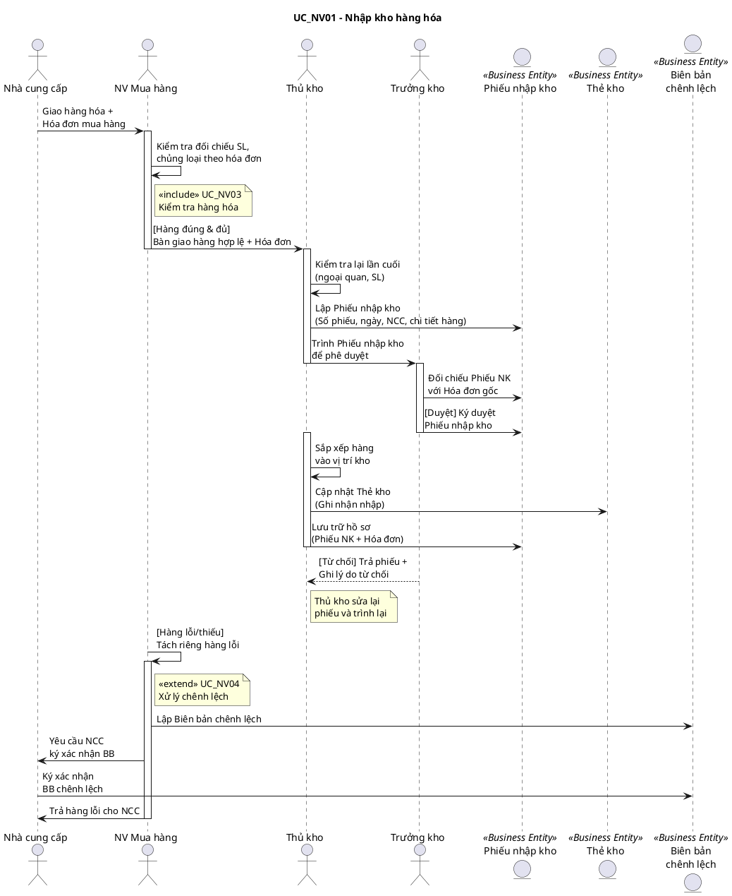

# Sơ đồ Tuần tự Nghiệp vụ – UC_NV01: Nhập kho hàng hóa

## Mô tả
Sơ đồ tuần tự thể hiện trình tự tương tác giữa các tác nhân, thừa tác viên và thực thể nghiệp vụ trong quy trình nhập kho hàng hóa.

