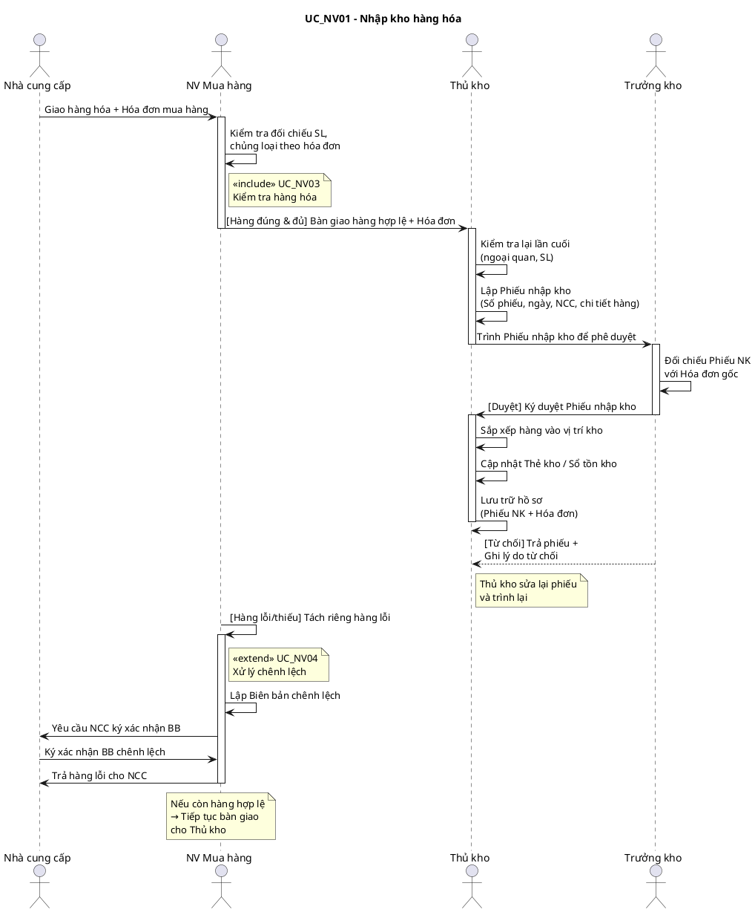

# Sơ đồ Tuần tự Nghiệp vụ – UC_NV01: Nhập kho hàng hóa

## Luồng chính + Luồng phụ (gộp)

```plantuml
@startuml
title UC_NV01 – Nhập kho hàng hóa

actor "Nhà cung cấp" as NCC
actor "NV Mua hàng" as NVMH
actor "Thủ kho" as TK
actor "Trưởng kho" as TrK

NCC -> NVMH : Giao hàng hóa + Hóa đơn mua hàng
activate NVMH
NVMH -> NVMH : Kiểm tra đối chiếu SL,\nchủng loại theo hóa đơn
note right of NVMH : <<include>> UC_NV03\nKiểm tra hàng hóa

NVMH -> TK : [Hàng đúng & đủ] Bàn giao hàng hợp lệ + Hóa đơn
deactivate NVMH

activate TK
TK -> TK : Kiểm tra lại lần cuối\n(ngoại quan, SL)
TK -> TK : Lập Phiếu nhập kho\n(Số phiếu, ngày, NCC, chi tiết hàng)
TK -> TrK : Trình Phiếu nhập kho để phê duyệt
deactivate TK

activate TrK
TrK -> TrK : Đối chiếu Phiếu NK\nvới Hóa đơn gốc
TrK -> TK : [Duyệt] Ký duyệt Phiếu nhập kho
deactivate TrK

activate TK
TK -> TK : Sắp xếp hàng vào vị trí kho
TK -> TK : Cập nhật Thẻ kho / Sổ tồn kho
TK -> TK : Lưu trữ hồ sơ\n(Phiếu NK + Hóa đơn)
deactivate TK

TrK --> TK : [Từ chối] Trả phiếu +\nGhi lý do từ chối
note right of TK : Thủ kho sửa lại phiếu\nvà trình lại

NVMH -> NVMH : [Hàng lỗi/thiếu] Tách riêng hàng lỗi
activate NVMH
note right of NVMH : <<extend>> UC_NV04\nXử lý chênh lệch
NVMH -> NVMH : Lập Biên bản chênh lệch
NVMH -> NCC : Yêu cầu NCC ký xác nhận BB
NCC -> NVMH : Ký xác nhận BB chênh lệch
NVMH -> NCC : Trả hàng lỗi cho NCC
deactivate NVMH
note over NVMH : Nếu còn hàng hợp lệ\n→ Tiếp tục bàn giao\ncho Thủ kho

@enduml
```
