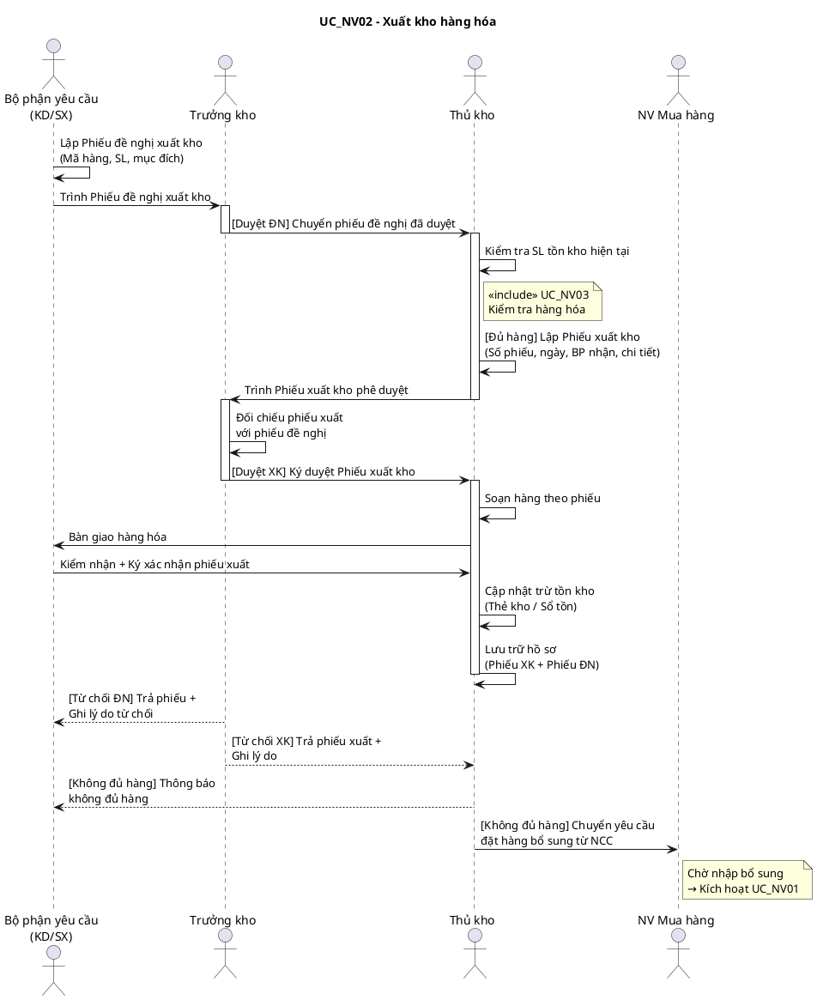

# Sơ đồ Tuần tự Nghiệp vụ – UC_NV02: Xuất kho hàng hóa

## Luồng chính + Luồng phụ (gộp)

```plantuml
@startuml
title UC_NV02 – Xuất kho hàng hóa

actor "Bộ phận yêu cầu\n(KD/SX)" as BPYC
actor "Trưởng kho" as TrK
actor "Thủ kho" as TK
actor "NV Mua hàng" as NVMH

BPYC -> BPYC : Lập Phiếu đề nghị xuất kho\n(Mã hàng, SL, mục đích)
BPYC -> TrK : Trình Phiếu đề nghị xuất kho
activate TrK
TrK -> TK : [Duyệt ĐN] Chuyển phiếu đề nghị đã duyệt
deactivate TrK

activate TK
TK -> TK : Kiểm tra SL tồn kho hiện tại
note right of TK : <<include>> UC_NV03\nKiểm tra hàng hóa

TK -> TK : [Đủ hàng] Lập Phiếu xuất kho\n(Số phiếu, ngày, BP nhận, chi tiết)
TK -> TrK : Trình Phiếu xuất kho phê duyệt
deactivate TK

activate TrK
TrK -> TrK : Đối chiếu phiếu xuất\nvới phiếu đề nghị
TrK -> TK : [Duyệt XK] Ký duyệt Phiếu xuất kho
deactivate TrK

activate TK
TK -> TK : Soạn hàng theo phiếu
TK -> BPYC : Bàn giao hàng hóa
BPYC -> TK : Kiểm nhận + Ký xác nhận phiếu xuất
TK -> TK : Cập nhật trừ tồn kho\n(Thẻ kho / Sổ tồn)
TK -> TK : Lưu trữ hồ sơ\n(Phiếu XK + Phiếu ĐN)
deactivate TK

TrK --> BPYC : [Từ chối ĐN] Trả phiếu +\nGhi lý do từ chối

TrK --> TK : [Từ chối XK] Trả phiếu xuất +\nGhi lý do

TK --> BPYC : [Không đủ hàng] Thông báo\nkhông đủ hàng
TK -> NVMH : [Không đủ hàng] Chuyển yêu cầu\nđặt hàng bổ sung từ NCC
note right of NVMH : Chờ nhập bổ sung\n→ Kích hoạt UC_NV01

@enduml
```
