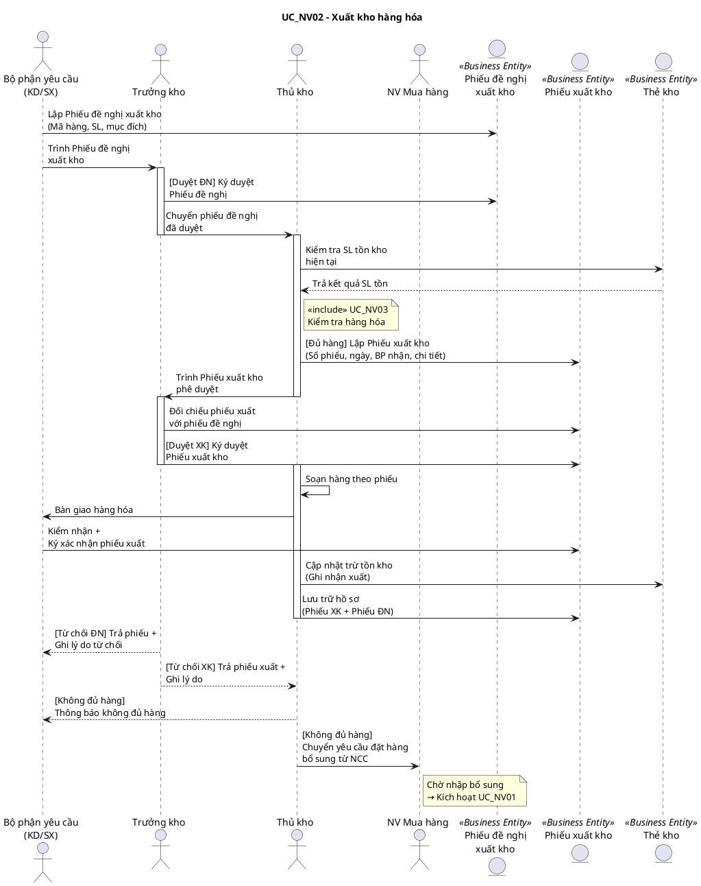

# Sơ đồ Tuần tự Nghiệp vụ – UC_NV02: Xuất kho hàng hóa

```plantuml
@startuml
title UC_NV02 – Xuất kho hàng hóa

actor "Bộ phận yêu cầu\n(KD/SX)" as BPYC
actor "Trưởng kho" as TrK
actor "Thủ kho" as TK
actor "NV Mua hàng" as NVMH
entity "Phiếu đề nghị\nxuất kho" as PDN <<Business Entity>>
entity "Phiếu xuất kho" as PXK <<Business Entity>>
entity "Thẻ kho" as TheKho <<Business Entity>>

BPYC -> PDN : Lập Phiếu đề nghị xuất kho\n(Mã hàng, SL, mục đích)
BPYC -> TrK : Trình Phiếu đề nghị\nxuất kho
activate TrK
TrK -> PDN : [Duyệt ĐN] Ký duyệt\nPhiếu đề nghị
TrK -> TK : Chuyển phiếu đề nghị\nđã duyệt
deactivate TrK

activate TK
TK -> TheKho : Kiểm tra SL tồn kho\nhiện tại
TheKho --> TK : Trả kết quả SL tồn
note right of TK : <<include>> UC_NV03\nKiểm tra hàng hóa

TK -> PXK : [Đủ hàng] Lập Phiếu xuất kho\n(Số phiếu, ngày, BP nhận, chi tiết)
TK -> TrK : Trình Phiếu xuất kho\nphê duyệt
deactivate TK

activate TrK
TrK -> PXK : Đối chiếu phiếu xuất\nvới phiếu đề nghị
TrK -> PXK : [Duyệt XK] Ký duyệt\nPhiếu xuất kho
deactivate TrK

activate TK
TK -> TK : Soạn hàng theo phiếu
TK -> BPYC : Bàn giao hàng hóa
BPYC -> PXK : Kiểm nhận +\nKý xác nhận phiếu xuất
TK -> TheKho : Cập nhật trừ tồn kho\n(Ghi nhận xuất)
TK -> PXK : Lưu trữ hồ sơ\n(Phiếu XK + Phiếu ĐN)
deactivate TK

TrK --> BPYC : [Từ chối ĐN] Trả phiếu +\nGhi lý do từ chối

TrK --> TK : [Từ chối XK] Trả phiếu xuất +\nGhi lý do

TK --> BPYC : [Không đủ hàng]\nThông báo không đủ hàng
TK -> NVMH : [Không đủ hàng]\nChuyển yêu cầu đặt hàng\nbổ sung từ NCC
note right of NVMH : Chờ nhập bổ sung\n→ Kích hoạt UC_NV01

@enduml
```
