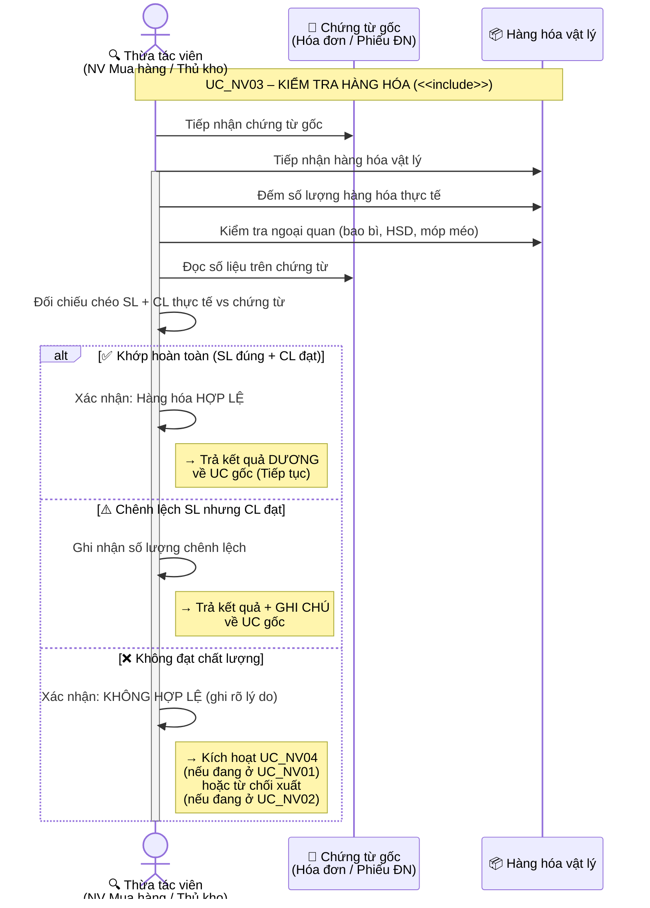

# Sơ đồ Tuần tự Nghiệp vụ – UC_NV03: Kiểm tra hàng hóa

```mermaid
sequenceDiagram
    actor TAV as 🔍 Thừa tác viên<br/>(NV Mua hàng / Thủ kho)
    participant CT as 📄 Chứng từ gốc<br/>(Hóa đơn / Phiếu ĐN)
    participant HH as 📦 Hàng hóa vật lý

    Note over TAV, HH: UC_NV03 – KIỂM TRA HÀNG HÓA (<<include>>)

    TAV->>CT: Tiếp nhận chứng từ gốc
    TAV->>HH: Tiếp nhận hàng hóa vật lý
    activate TAV
    
    TAV->>HH: Đếm số lượng hàng hóa thực tế
    TAV->>HH: Kiểm tra ngoại quan (bao bì, HSD, móp méo)
    TAV->>CT: Đọc số liệu trên chứng từ
    TAV->>TAV: Đối chiếu chéo SL + CL thực tế vs chứng từ
    
    alt ✅ Khớp hoàn toàn (SL đúng + CL đạt)
        TAV->>TAV: Xác nhận: Hàng hóa HỢP LỆ
        Note right of TAV: → Trả kết quả DƯƠNG<br/>về UC gốc (Tiếp tục)
    else ⚠️ Chênh lệch SL nhưng CL đạt
        TAV->>TAV: Ghi nhận số lượng chênh lệch
        Note right of TAV: → Trả kết quả + GHI CHÚ<br/>về UC gốc
    else ❌ Không đạt chất lượng
        TAV->>TAV: Xác nhận: KHÔNG HỢP LỆ (ghi rõ lý do)
        Note right of TAV: → Kích hoạt UC_NV04<br/>(nếu đang ở UC_NV01)<br/>hoặc từ chối xuất<br/>(nếu đang ở UC_NV02)
    end
    deactivate TAV
```
