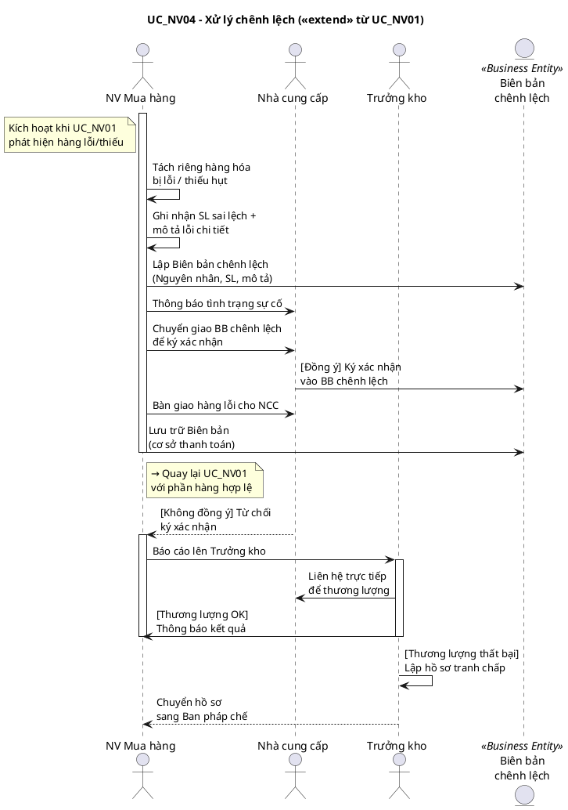

# Sơ đồ Tuần tự Nghiệp vụ – UC_NV04: Xử lý chênh lệch

```plantuml
@startuml
title UC_NV04 – Xử lý chênh lệch (<<extend>> từ UC_NV01)

actor "NV Mua hàng" as NVMH
actor "Nhà cung cấp" as NCC
actor "Trưởng kho" as TrK
entity "Biên bản\nchênh lệch" as BBCL <<Business Entity>>

note left of NVMH : Kích hoạt khi UC_NV01\nphát hiện hàng lỗi/thiếu

activate NVMH
NVMH -> NVMH : Tách riêng hàng hóa\nbị lỗi / thiếu hụt
NVMH -> NVMH : Ghi nhận SL sai lệch +\nmô tả lỗi chi tiết
NVMH -> BBCL : Lập Biên bản chênh lệch\n(Nguyên nhân, SL, mô tả)
NVMH -> NCC : Thông báo tình trạng sự cố
NVMH -> NCC : Chuyển giao BB chênh lệch\nđể ký xác nhận

NCC -> BBCL : [Đồng ý] Ký xác nhận\nvào BB chênh lệch
NVMH -> NCC : Bàn giao hàng lỗi cho NCC
NVMH -> BBCL : Lưu trữ Biên bản\n(cơ sở thanh toán)
deactivate NVMH
note right of NVMH : → Quay lại UC_NV01\nvới phần hàng hợp lệ

NCC --> NVMH : [Không đồng ý] Từ chối\nký xác nhận
activate NVMH
NVMH -> TrK : Báo cáo lên Trưởng kho
activate TrK
TrK -> NCC : Liên hệ trực tiếp\nđể thương lượng

TrK -> NVMH : [Thương lượng OK]\nThông báo kết quả
deactivate TrK
deactivate NVMH

TrK -> TrK : [Thương lượng thất bại]\nLập hồ sơ tranh chấp
TrK --> NVMH : Chuyển hồ sơ\nsang Ban pháp chế

@enduml
```
