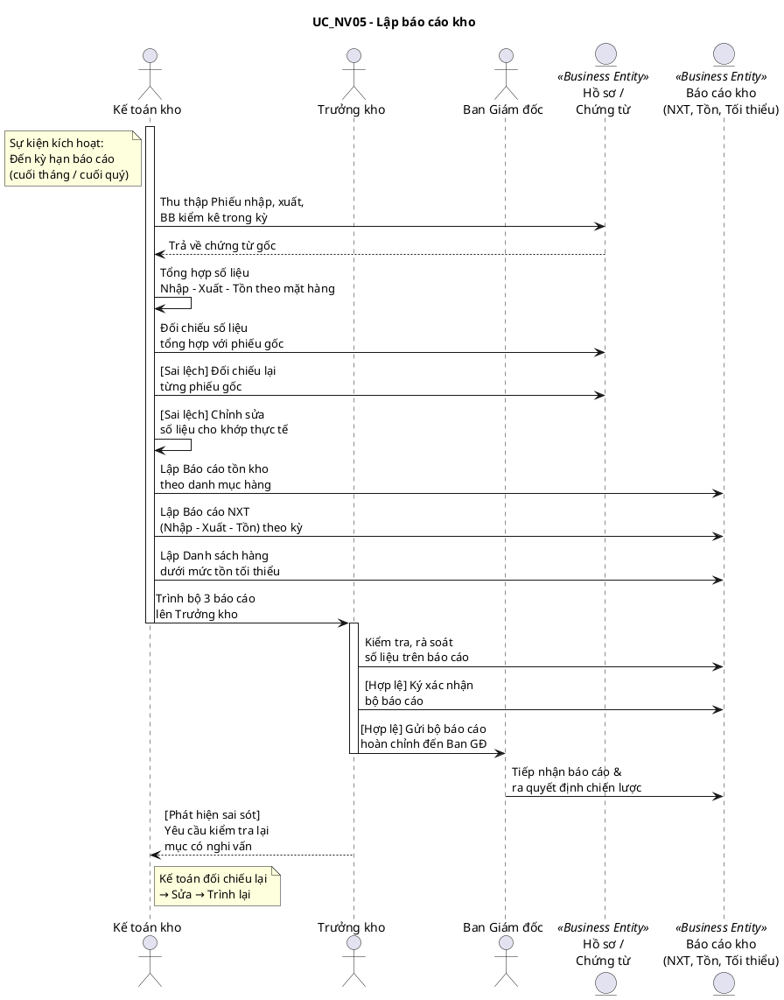

# Sơ đồ Tuần tự Nghiệp vụ – UC_NV05: Lập báo cáo kho

```plantuml
@startuml
title UC_NV05 – Lập báo cáo kho

actor "Kế toán kho" as KTK
actor "Trưởng kho" as TrK
actor "Ban Giám đốc" as BGD
entity "Hồ sơ /\nChứng từ" as HS <<Business Entity>>
entity "Báo cáo kho\n(NXT, Tồn, Tối thiểu)" as BC <<Business Entity>>

note left of KTK : Sự kiện kích hoạt:\nĐến kỳ hạn báo cáo\n(cuối tháng / cuối quý)

activate KTK
KTK -> HS : Thu thập Phiếu nhập, xuất,\nBB kiểm kê trong kỳ
HS --> KTK : Trả về chứng từ gốc

KTK -> KTK : Tổng hợp số liệu\nNhập – Xuất – Tồn theo mặt hàng
KTK -> HS : Đối chiếu số liệu\ntổng hợp với phiếu gốc

KTK -> HS : [Sai lệch] Đối chiếu lại\ntừng phiếu gốc
KTK -> KTK : [Sai lệch] Chỉnh sửa\nsố liệu cho khớp thực tế

KTK -> BC : Lập Báo cáo tồn kho\ntheo danh mục hàng
KTK -> BC : Lập Báo cáo NXT\n(Nhập – Xuất – Tồn) theo kỳ
KTK -> BC : Lập Danh sách hàng\ndưới mức tồn tối thiểu

KTK -> TrK : Trình bộ 3 báo cáo\nlên Trưởng kho
deactivate KTK

activate TrK
TrK -> BC : Kiểm tra, rà soát\nsố liệu trên báo cáo

TrK -> BC : [Hợp lệ] Ký xác nhận\nbộ báo cáo
TrK -> BGD : [Hợp lệ] Gửi bộ báo cáo\nhoàn chỉnh đến Ban GĐ
deactivate TrK

BGD -> BC : Tiếp nhận báo cáo &\nra quyết định chiến lược

TrK --> KTK : [Phát hiện sai sót]\nYêu cầu kiểm tra lại\nmục có nghi vấn
note right of KTK : Kế toán đối chiếu lại\n→ Sửa → Trình lại

@enduml
```
