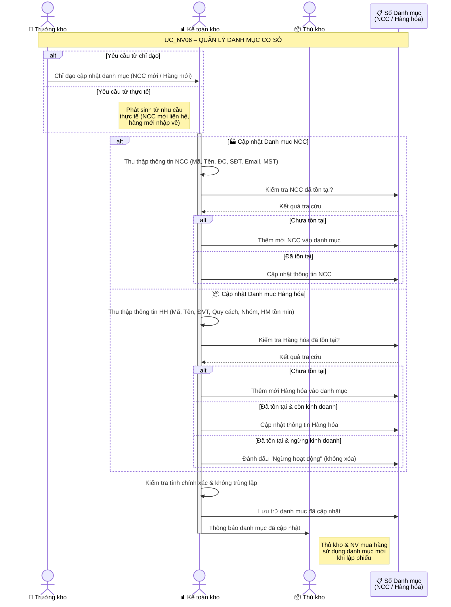

# Sơ đồ Tuần tự Nghiệp vụ – UC_NV06: Quản lý danh mục cơ sở

```mermaid
sequenceDiagram
    actor TrK as 👔 Trưởng kho
    actor KTK as 📊 Kế toán kho
    actor TK as 📦 Thủ kho
    participant DM as 📋 Sổ Danh mục<br/>(NCC / Hàng hóa)

    Note over TrK, DM: UC_NV06 – QUẢN LÝ DANH MỤC CƠ SỞ

    alt Yêu cầu từ chỉ đạo
        TrK->>KTK: Chỉ đạo cập nhật danh mục (NCC mới / Hàng mới)
    else Yêu cầu từ thực tế
        Note left of KTK: Phát sinh từ nhu cầu<br/>thực tế (NCC mới liên hệ,<br/>hàng mới nhập về)
    end
    
    activate KTK

    alt 🏭 Cập nhật Danh mục NCC
        KTK->>KTK: Thu thập thông tin NCC (Mã, Tên, ĐC, SĐT, Email, MST)
        KTK->>DM: Kiểm tra NCC đã tồn tại?
        DM-->>KTK: Kết quả tra cứu

        alt Chưa tồn tại
            KTK->>DM: Thêm mới NCC vào danh mục
        else Đã tồn tại
            KTK->>DM: Cập nhật thông tin NCC
        end

    else 📦 Cập nhật Danh mục Hàng hóa
        KTK->>KTK: Thu thập thông tin HH (Mã, Tên, ĐVT, Quy cách, Nhóm, HM tồn min)
        KTK->>DM: Kiểm tra Hàng hóa đã tồn tại?
        DM-->>KTK: Kết quả tra cứu

        alt Chưa tồn tại
            KTK->>DM: Thêm mới Hàng hóa vào danh mục
        else Đã tồn tại & còn kinh doanh
            KTK->>DM: Cập nhật thông tin Hàng hóa
        else Đã tồn tại & ngừng kinh doanh
            KTK->>DM: Đánh dấu "Ngừng hoạt động" (không xóa)
        end
    end

    KTK->>KTK: Kiểm tra tính chính xác & không trùng lặp
    KTK->>DM: Lưu trữ danh mục đã cập nhật
    KTK->>TK: Thông báo danh mục đã cập nhật
    deactivate KTK
    
    Note right of TK: Thủ kho & NV mua hàng<br/>sử dụng danh mục mới<br/>khi lập phiếu
```
