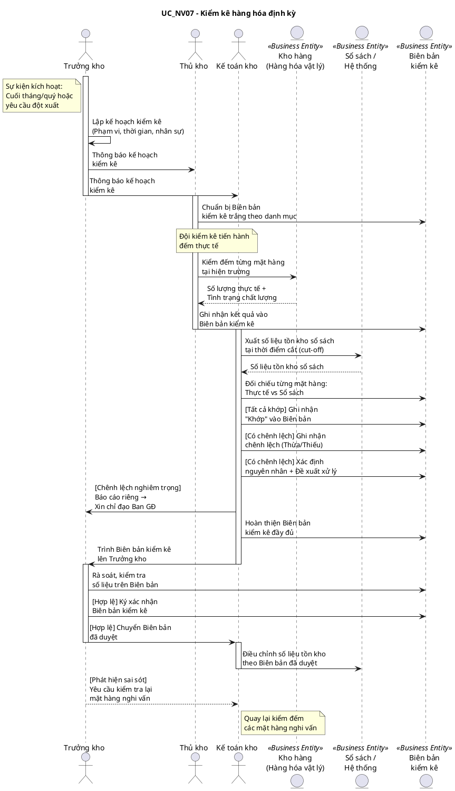

# Sơ đồ Tuần tự Nghiệp vụ – UC_NV07: Kiểm kê hàng hóa định kỳ

```plantuml
@startuml
title UC_NV07 – Kiểm kê hàng hóa định kỳ

actor "Trưởng kho" as TrK
actor "Thủ kho" as TK
actor "Kế toán kho" as KTK
entity "Kho hàng\n(Hàng hóa vật lý)" as KHO <<Business Entity>>
entity "Sổ sách /\nHệ thống" as SS <<Business Entity>>
entity "Biên bản\nkiểm kê" as BBKK <<Business Entity>>

note left of TrK : Sự kiện kích hoạt:\nCuối tháng/quý hoặc\nyêu cầu đột xuất

activate TrK
TrK -> TrK : Lập kế hoạch kiểm kê\n(Phạm vi, thời gian, nhân sự)
TrK -> TK : Thông báo kế hoạch\nkiểm kê
TrK -> KTK : Thông báo kế hoạch\nkiểm kê
deactivate TrK

activate TK
TK -> BBKK : Chuẩn bị Biên bản\nkiểm kê trắng theo danh mục

note over TK, KTK : Đội kiểm kê tiến hành\nđếm thực tế

TK -> KHO : Kiểm đếm từng mặt hàng\ntại hiện trường
KHO --> TK : Số lượng thực tế +\nTình trạng chất lượng
TK -> BBKK : Ghi nhận kết quả vào\nBiên bản kiểm kê
deactivate TK

activate KTK
KTK -> SS : Xuất số liệu tồn kho sổ sách\ntại thời điểm cắt (cut-off)
SS --> KTK : Số liệu tồn kho sổ sách

KTK -> BBKK : Đối chiếu từng mặt hàng:\nThực tế vs Sổ sách

KTK -> BBKK : [Tất cả khớp] Ghi nhận\n"Khớp" vào Biên bản

KTK -> BBKK : [Có chênh lệch] Ghi nhận\nchênh lệch (Thừa/Thiếu)
KTK -> BBKK : [Có chênh lệch] Xác định\nnguyên nhân + Đề xuất xử lý

KTK -> TrK : [Chênh lệch nghiêm trọng]\nBáo cáo riêng →\nXin chỉ đạo Ban GĐ

KTK -> BBKK : Hoàn thiện Biên bản\nkiểm kê đầy đủ
KTK -> TrK : Trình Biên bản kiểm kê\nlên Trưởng kho
deactivate KTK

activate TrK
TrK -> BBKK : Rà soát, kiểm tra\nsố liệu trên Biên bản

TrK -> BBKK : [Hợp lệ] Ký xác nhận\nBiên bản kiểm kê
TrK -> KTK : [Hợp lệ] Chuyển Biên bản\nđã duyệt
deactivate TrK

activate KTK
KTK -> SS : Điều chỉnh số liệu tồn kho\ntheo Biên bản đã duyệt
deactivate KTK

TrK --> KTK : [Phát hiện sai sót]\nYêu cầu kiểm tra lại\nmặt hàng nghi vấn
note right of KTK : Quay lại kiểm đếm\ncác mặt hàng nghi vấn

@enduml
```
