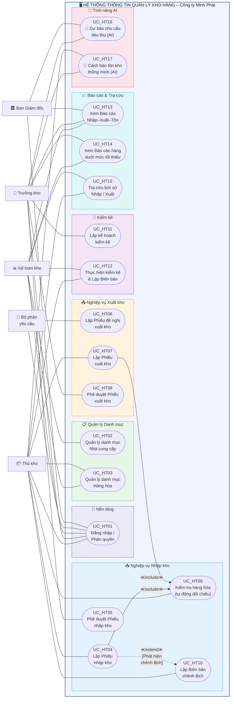

# Sơ đồ Use Case Hệ thống – HTTT Quản lý Kho hàng

## Mô tả tổng quan

Sơ đồ Use Case hệ thống mô tả các **chức năng mà phần mềm phải cung cấp** để hỗ trợ và tự động hóa các quy trình nghiệp vụ đã phân tích ở mục 2.2. Khác với Use Case nghiệp vụ (miêu tả hoạt động thực tế của con người), Use Case hệ thống tập trung vào **tương tác giữa người dùng (Actor) và phần mềm (System)**.

### Tác nhân hệ thống (System Actors)

| Actor | Miêu tả | Suy ra từ Actor nghiệp vụ |
|---|---|---|
| Thủ kho | Người trực tiếp thao tác trên hệ thống để lập phiếu nhập/xuất, kiểm kê, cập nhật tồn | Thủ kho (NV) |
| Trưởng kho | Người phê duyệt phiếu, xem báo cáo, lập kế hoạch kiểm kê, xem dự báo AI | Trưởng kho / Quản lý (NV) |
| Kế toán kho | Quản lý danh mục NCC/Hàng hóa, lập báo cáo NXT, tra cứu lịch sử | Kế toán kho (NV) |
| Bộ phận yêu cầu | Lập phiếu đề nghị xuất kho trên hệ thống | Bộ phận yêu cầu KD/SX (NV) |
| Ban Giám đốc | Xem báo cáo tổng hợp, xem dự báo AI | Ban Giám đốc (NV) |

> **Lưu ý:** "Nhà cung cấp" không phải là Actor hệ thống vì NCC không trực tiếp thao tác trên phần mềm. Thông tin NCC được nhập bởi Kế toán kho.

### Ma trận Truy vết (Traceability Matrix): UC Nghiệp vụ → UC Hệ thống

| UC Nghiệp vụ | UC Hệ thống được suy ra |
|---|---|
| UC_NV06 – Quản lý danh mục cơ sở | UC_HT02, UC_HT03 |
| UC_NV01 – Nhập kho hàng hóa | UC_HT04, UC_HT05, UC_HT09 |
| UC_NV02 – Xuất kho hàng hóa | UC_HT06, UC_HT07, UC_HT08, UC_HT09 |
| UC_NV03 – Kiểm tra hàng hóa | UC_HT09 (tự động đối chiếu) |
| UC_NV04 – Xử lý chênh lệch | UC_HT10 |
| UC_NV07 – Kiểm kê hàng hóa | UC_HT11, UC_HT12 |
| UC_NV05 – Lập báo cáo kho | UC_HT13, UC_HT14 |
| Yêu cầu nền tảng hệ thống | UC_HT01, UC_HT15 |
| Tính năng nâng cao (AI) | UC_HT16, UC_HT17 |

---

## Sơ đồ Use Case Hệ thống

---

## 📐 Hướng dẫn vẽ lại trong IBM Rational Rose

### Actors (Hình người – Stick figure)
Đặt **bên trái** hoặc **bên phải** System Boundary tùy layout:
- Trái: Thủ kho, Kế toán kho, Bộ phận yêu cầu
- Phải: Trưởng kho, Ban Giám đốc

### System Boundary
- Vẽ **1 hình chữ nhật lớn** bao quanh tất cả 17 UC
- Tiêu đề: `HTTT Quản lý Kho hàng – Công ty Minh Phát`

### Use Cases (Hình Ellipse)
17 UC – mỗi UC là 1 Ellipse nằm trong System Boundary. Nhóm theo chức năng (không bắt buộc trong Rose nhưng giúp dễ đọc).

### Association (Đường thẳng liền nét)
| Actor | UC liên kết |
|---|---|
| Thủ kho | UC01, UC03, UC04, UC07, UC09, UC10, UC12, UC15, UC17 |
| Trưởng kho | UC01, UC05, UC08, UC11, UC13, UC14, UC16, UC17 |
| Kế toán kho | UC01, UC02, UC03, UC12, UC13, UC14, UC15 |
| Bộ phận yêu cầu | UC01, UC06 |
| Ban Giám đốc | UC01, UC13, UC16 |

### Quan hệ Include (Mũi tên đứt nét → từ UC chính → UC phụ)
- UC_HT04 (Lập Phiếu NK) **→** `<<include>>` **→** UC_HT09 (Kiểm tra HH)
- UC_HT07 (Lập Phiếu XK) **→** `<<include>>` **→** UC_HT09 (Kiểm tra HH)

### Quan hệ Extend (Mũi tên đứt nét → từ UC mở rộng → UC chính)
- UC_HT10 (Lập BB chênh lệch) **→** `<<extend>>` **→** UC_HT04 (Lập Phiếu NK)
- Guard condition: `[Phát hiện chênh lệch SL hoặc CL]`

> **⚠️ Chiều mũi tên Rose:**  
> - `<<include>>`: UC chính → UC phụ  
> - `<<extend>>`: UC mở rộng → UC chính
