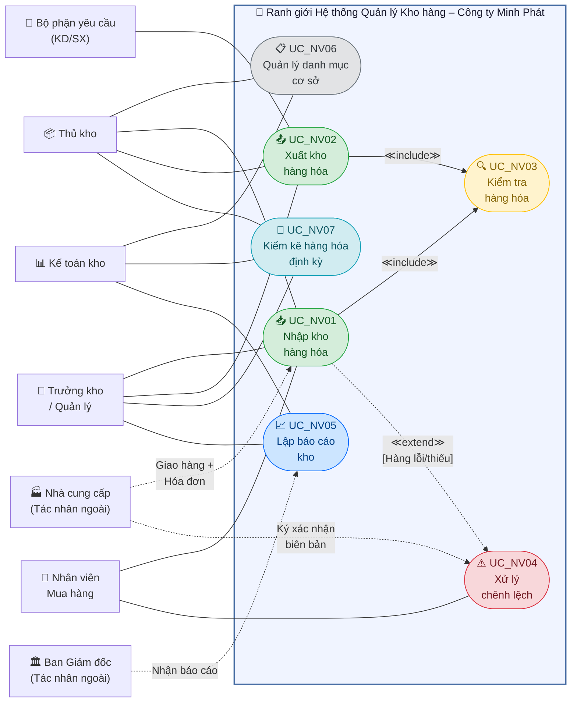

# Sơ đồ Use Case Nghiệp vụ – HTTT Quản lý Kho hàng

## Mô tả tổng quan
Sơ đồ Use Case nghiệp vụ dưới đây mô tả toàn bộ các quy trình nghiệp vụ (Business Processes) diễn ra trong hoạt động quản lý kho hàng tại Công ty TNHH TM-DV Hàng Tiêu Dùng Minh Phát. Các tác nhân nghiệp vụ (Business Actors) được xác định bao gồm cả nhân sự nội bộ và đối tác bên ngoài ranh giới tổ chức.

### Quy ước ký hiệu
- **Hình người (Actor):** Tác nhân nghiệp vụ tham gia trực tiếp vào quy trình.
- **Hình ellipse (Use Case):** Một quy trình nghiệp vụ có đầu vào, đầu ra và mục tiêu rõ ràng.
- **`<<include>>`:** UC phụ bắt buộc phải được thực thi khi UC chính được kích hoạt.
- **`<<extend>>`:** UC phụ chỉ được kích hoạt khi có điều kiện ngoại lệ xảy ra.
- **Đường thẳng (Association):** Tác nhân tham gia trực tiếp vào quy trình.

## Sơ đồ

> **Lưu ý:** Mermaid chưa hỗ trợ trực tiếp Use Case Diagram chuẩn UML. Dưới đây sử dụng `flowchart` để biểu diễn tương đương về mặt ngữ nghĩa. Nếu cần sơ đồ chuẩn UML hoàn hảo, có thể dùng PlantUML hoặc StarUML để vẽ lại từ cấu trúc này.

## Giải thích mối quan hệ giữa các Use Case

### Quan hệ `<<include>>` (Bắt buộc)
| UC Chính | UC Được Include | Giải thích |
|---|---|---|
| UC_NV01 – Nhập kho | UC_NV03 – Kiểm tra hàng hóa | Mỗi lần nhập kho, nghiệp vụ kiểm tra hàng hóa (đếm số lượng, kiểm ngoại quan, đối chiếu chứng từ) **bắt buộc** phải được thực hiện trước khi lập phiếu. |
| UC_NV02 – Xuất kho | UC_NV03 – Kiểm tra hàng hóa | Mỗi lần xuất kho, thủ kho **bắt buộc** phải kiểm tra số lượng tồn và chất lượng hàng trước khi tiến hành xuất. |

### Quan hệ `<<extend>>` (Có điều kiện)
| UC Chính | UC Mở rộng | Điều kiện kích hoạt |
|---|---|---|
| UC_NV01 – Nhập kho | UC_NV04 – Xử lý chênh lệch | Chỉ kích hoạt khi phát hiện hàng hóa bị lỗi, thiếu hụt hoặc sai quy cách so với hóa đơn trong quá trình kiểm tra tại bước nhập kho. |

### Tác nhân ngoài ranh giới
| Tác nhân | Vai trò | Tương tác |
|---|---|---|
| Nhà cung cấp (NCC) | Đối tác thương mại bên ngoài | Giao hàng + hóa đơn cho UC_NV01; Ký xác nhận biên bản chênh lệch tại UC_NV04. |
| Ban Giám đốc | Cấp quản trị cao nhất | Nhận báo cáo kho định kỳ từ UC_NV05 để ra quyết định chiến lược. |
