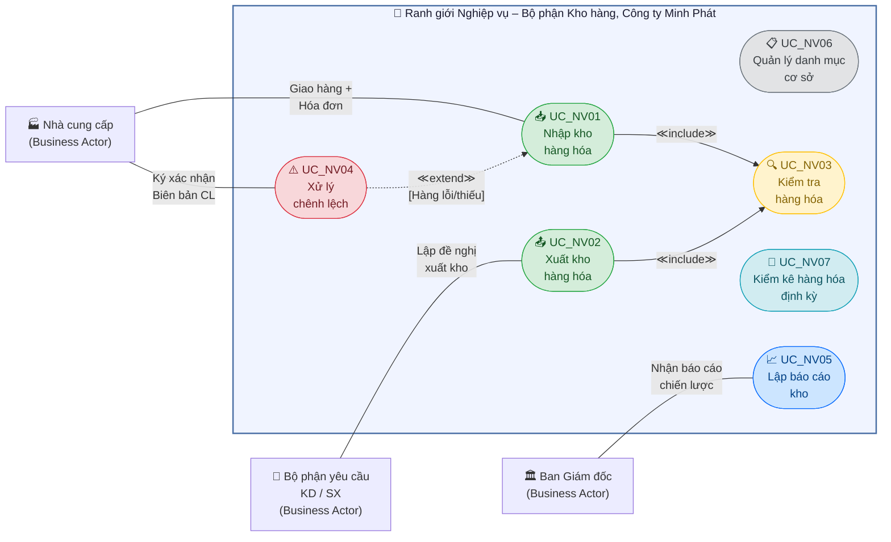

# Sơ đồ Use Case Nghiệp vụ – HTTT Quản lý Kho hàng

## Mô tả tổng quan

Sơ đồ Use Case nghiệp vụ dưới đây mô tả các **quy trình nghiệp vụ (Business Processes)** diễn ra trong hoạt động quản lý kho hàng tại Công ty TNHH TM-DV Hàng Tiêu Dùng Minh Phát.

### Phân loại tác nhân nghiệp vụ

> **⚠️ QUAN TRỌNG (Chuẩn UML Business Modeling):**
>
> Trong sơ đồ Use Case **nghiệp vụ**, cần phân biệt rõ:
> - **Business Actor** (Tác nhân nghiệp vụ): Người/Tổ chức **BÊN NGOÀI** ranh giới tổ chức, tương tác với hệ thống nghiệp vụ. → Được **VẼ** trên sơ đồ (hình người stick figure).
> - **Business Worker** (Thừa tác viên): Nhân viên **BÊN TRONG** tổ chức, trực tiếp thực hiện các bước trong quy trình nghiệp vụ. → **KHÔNG VẼ** trên sơ đồ UC nghiệp vụ.

| Phân loại | Tên | Giải thích |
|---|---|---|
| **Business Actor** (Tác nhân ngoài) | 🏭 Nhà cung cấp (NCC) | Đối tác thương mại bên ngoài tổ chức; giao hàng + hóa đơn |
| **Business Actor** (Tác nhân ngoài) | 🏢 Bộ phận yêu cầu (KD/SX) | Bộ phận khác trong công ty, NGOÀI phạm vi bộ phận kho; yêu cầu xuất hàng |
| **Business Actor** (Tác nhân ngoài) | 🏛️ Ban Giám đốc | Cấp quản trị cao nhất; nhận báo cáo kho |
| **Business Worker** (Thừa tác viên) | 👷 Nhân viên Mua hàng | Nội bộ bộ phận kho; tiếp nhận hàng, kiểm tra, lập biên bản |
| **Business Worker** (Thừa tác viên) | 📦 Thủ kho | Nội bộ bộ phận kho; lập phiếu NK/XK, sắp xếp, cập nhật tồn |
| **Business Worker** (Thừa tác viên) | 👔 Trưởng kho / Quản lý | Nội bộ bộ phận kho; phê duyệt phiếu, lập kế hoạch kiểm kê |
| **Business Worker** (Thừa tác viên) | 📊 Kế toán kho | Nội bộ bộ phận kho; quản lý danh mục, lập báo cáo NXT |

### Quy ước ký hiệu
- **Hình người (Actor):** Chỉ dành cho **Business Actor** – tác nhân BÊN NGOÀI ranh giới nghiệp vụ.
- **Hình ellipse (Use Case):** Một quy trình nghiệp vụ có đầu vào, đầu ra và mục tiêu rõ ràng.
- **`<<include>>`:** UC phụ bắt buộc phải được thực thi khi UC chính kích hoạt.
- **`<<extend>>`:** UC phụ chỉ kích hoạt khi có điều kiện ngoại lệ xảy ra.
- **Business Worker** được ghi chú trong phần mô tả sơ đồ nhưng **không xuất hiện** trên sơ đồ.

---

## Sơ đồ

> **Lưu ý:** Theo chuẩn UML, sơ đồ UC nghiệp vụ chỉ vẽ **Business Actor** (bên ngoài ranh giới). Các **Business Worker** (nhân viên nội bộ bộ phận kho) tham gia thực hiện UC nhưng KHÔNG được vẽ trên sơ đồ này.

---

## Giải thích mối quan hệ giữa các Use Case

### Quan hệ `<<include>>` (Bắt buộc)
| UC Chính | UC Được Include | Giải thích |
|---|---|---|
| UC_NV01 – Nhập kho | UC_NV03 – Kiểm tra hàng hóa | Mỗi lần nhập kho, nghiệp vụ kiểm tra hàng hóa (đếm số lượng, kiểm ngoại quan, đối chiếu chứng từ) **bắt buộc** phải được thực hiện trước khi lập phiếu. |
| UC_NV02 – Xuất kho | UC_NV03 – Kiểm tra hàng hóa | Mỗi lần xuất kho, thủ kho **bắt buộc** phải kiểm tra số lượng tồn và chất lượng hàng trước khi tiến hành xuất. |

### Quan hệ `<<extend>>` (Có điều kiện)
| UC Chính | UC Mở rộng | Điều kiện kích hoạt |
|---|---|---|
| UC_NV01 – Nhập kho | UC_NV04 – Xử lý chênh lệch | Chỉ kích hoạt khi phát hiện hàng hóa bị lỗi, thiếu hụt hoặc sai quy cách so với hóa đơn trong quá trình kiểm tra tại bước nhập kho. |

> **📐 Lưu ý IBM Rose:**  
> - Chiều mũi tên `<<extend>>`: **TỪ UC mở rộng (UC_NV04) → UC chính (UC_NV01)** (ngược với include).
> - Guard condition `[Hàng lỗi/thiếu]` đặt gần mũi tên extend.

### Business Actors (Tác nhân ngoài ranh giới)
| Tác nhân | Vai trò | Tương tác |
|---|---|---|
| Nhà cung cấp (NCC) | Đối tác thương mại bên ngoài | Giao hàng + hóa đơn cho UC_NV01; Ký xác nhận biên bản chênh lệch tại UC_NV04. |
| Bộ phận yêu cầu (KD/SX) | Bộ phận ngoài phạm vi Kho | Lập đề nghị xuất kho → tham gia UC_NV02. |
| Ban Giám đốc | Cấp quản trị cao nhất | Nhận báo cáo kho định kỳ từ UC_NV05 để ra quyết định chiến lược. |

### Business Workers (Thừa tác viên – KHÔNG vẽ trên sơ đồ)
| Thừa tác viên | Tham gia UC nào |
|---|---|
| NV Mua hàng | UC_NV01 (tiếp nhận, kiểm tra), UC_NV03 (đếm kiểm), UC_NV04 (lập BB) |
| Thủ kho | UC_NV01 (lập phiếu NK), UC_NV02 (soạn hàng, lập phiếu XK), UC_NV03, UC_NV06, UC_NV07 |
| Trưởng kho / Quản lý | UC_NV01 (phê duyệt phiếu NK), UC_NV02 (phê duyệt), UC_NV05, UC_NV07 (lập kế hoạch KK) |
| Kế toán kho | UC_NV05 (lập báo cáo NXT), UC_NV06 (quản lý danh mục), UC_NV07 (đối chiếu sổ sách) |
